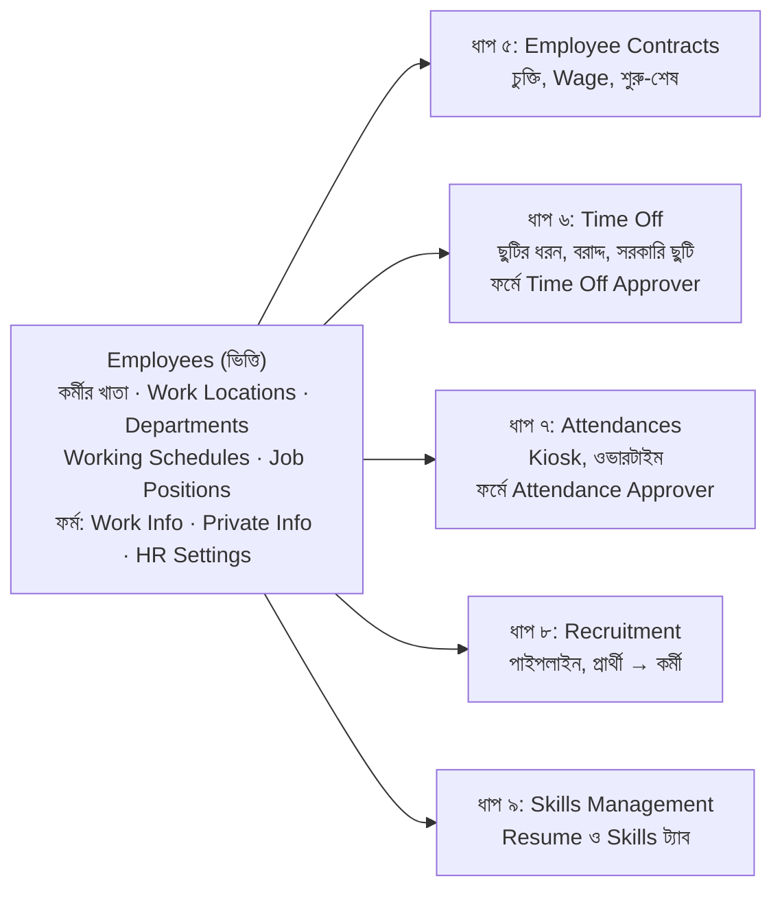
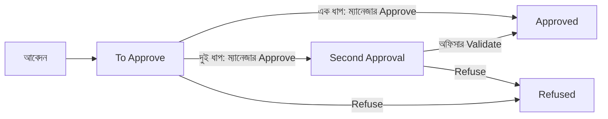

# Odoo HRM শূন্য থেকে: রূপসা গার্মেন্টসের সম্পূর্ণ হাতে-কলমে গাইড

*Odoo 17/18 Community · ডেমো কোম্পানি: Rupsha Garments Ltd. · সেপ্টেম্বর ২০২৬*

---

## সূচিপত্র

- ভূমিকা: গল্প, চরিত্র, কীভাবে পড়বেন
- বড় ছবি: কোন মডিউল কী যোগ করে, কোন কাজের আগে কোনটা
- ধাপ ১: ডাটাবেস, Employees মডিউল ও কোম্পানি
- ধাপ ২: কারখানার কাঠামো (ফ্লোর, বিভাগ, শিফট, পদ)
- ধাপ ৩: কর্মী যোগ (শ্রমিক থেকে ম্যানেজার)
- ধাপ ৪: বিভাগে Manager, User ও অধিকার
- ধাপ ৫: Employee Contracts মডিউল (চুক্তি ও মজুরি)
- ধাপ ৬: Time Off মডিউল (ছুটি)
- ধাপ ৭: Attendances মডিউল (গেটে কার্ড, ওভারটাইম)
- ধাপ ৮: Recruitment মডিউল (অপারেটর নিয়োগ)
- ধাপ ৯: Skills Management মডিউল (দক্ষতা ও প্রশিক্ষণ)
- ধাপ ১০: বিদায় (Offboarding) ও রিপোর্ট
- ধাপ ১১: বেতন (Community-র সীমা ও হিসাব)
- চূড়ান্ত চেকলিস্ট ও সাধারণ ভুল

---

## ভূমিকা: গল্প, চরিত্র, কীভাবে পড়বেন

এই গাইডে আপনি একটা খালি Odoo থেকে একটা গার্মেন্টস কারখানার পুরো HR সিস্টেম বানাবেন, **একবারে একটা মডিউল** করে।

### প্রতিটা ধাপ একই ছাঁচে লেখা

| অংশ | কী থাকে |
| --- | --- |
| গল্প | কারখানায় কী ঘটল, কেন এই কাজ দরকার |
| কোথায় | কোন মেনু দিয়ে ফর্মে যাবেন |
| ফর্মের ঘর | ফর্মের প্রতিটা ঘরের সহজ মানে, আর কী দেবেন |
| হুবহু ডেটা | ঠিক যা টাইপ করবেন |
| Odoo কী করে | ডেটা দেওয়ার পর পেছনে কী ঘটে |
| অন্য ডেটা দিলে কী হয় | ভিন্ন পরিস্থিতিতে ভিন্ন মান দিলে ফল কী, ডেমোসহ |
| যাচাই | ঠিক হয়েছে কি না মিলিয়ে দেখার সংখ্যা |

"অন্য ডেটা দিলে কী হয়" অংশের ডেমোগুলো শেখার জন্য। চেষ্টা করতে চাইলে নাম `TEST – ...` দিয়ে আলাদা রেকর্ড বানান, দেখা শেষে Archive করুন; গল্পের আসল ডেটা বদলাবেন না, নইলে পরের যাচাইয়ের সংখ্যা মিলবে না।

### একটা ছোট্ট উদাহরণ দিয়ে শুরু

Odoo-কে একটা খালি বাড়ি ভাবুন। **Employees** মডিউল হলো প্রথম ঘর: এখানে সবার নামের খাতা। পরে **Time Off** ঘর জোড়া হলে প্রথম ঘরের খাতায়ও নতুন কলাম আসে ("কে ছুটি অনুমোদন করবে")। নতুন ঘর পুরনো ঘর ভাঙে না, শুধু নতুন জিনিস জুড়ে দেয়। তাই প্রতিটা মডিউলের ধাপে "ইনস্টলের আগে কী ছিল, পরে কী এলো" টেবিলও আছে।

### গল্পের কারখানা

**রূপসা গার্মেন্টস লিমিটেড**, কোনাবাড়ি, গাজীপুর। টি-শার্ট বানায়। প্রথম তলায় কাটিং, দ্বিতীয় তলায় সেলাই, তৃতীয় তলায় ফিনিশিং, পাশে অফিস ব্লক। কাজ শনি থেকে বৃহস্পতি, শুক্রবার সাপ্তাহিক ছুটি। এতদিন হাজিরা রেজিস্টার খাতায়, ছুটি কাগজের ফর্মে, ওভারটাইম Excel-এ। বায়ারের কমপ্লায়েন্স অডিটে খাতা মেলাতে এক সপ্তাহ লেগেছিল। তাই HR ম্যানেজার নাসরিন সুলতানা সব Odoo-তে নিচ্ছেন। আপনি নাসরিনের জায়গায় বসে কাজ করবেন।

| চরিত্র | পদ | বিভাগ | Odoo লগইন | গল্পে কী করবেন |
| --- | --- | --- | --- | --- |
| কামরুল হাসান | Managing Director | Management | আছে | ম্যানেজারদের ছুটি অনুমোদন, রিপোর্ট |
| নাসরিন সুলতানা | HR & Compliance Manager | HR & Compliance | আছে (অ্যাডমিন) | গল্পের নায়ক, সব সেটআপ |
| তানিয়া ইসলাম | HR Officer | HR & Compliance | আছে | শ্রমিকদের হয়ে আবেদন, হাজিরা সংশোধন |
| লিটন দাস | Accounts Officer | Accounts | আছে | মজুরি ও ওভারটাইম হিসাব |
| জাহিদ হাসান | Production Manager | Production | আছে | সুপারভাইজারদের অনুমোদন |
| সেলিনা আকতার | Line Chief | Sewing | আছে | সেলাই লাইনের ছুটি ও ওভারটাইম অনুমোদন |
| বাবুল মিয়া | Cutting Supervisor | Cutting | আছে | কাটিং দল |
| রোকসানা বেগম | Sewing Operator | Sewing | **নেই** | কার্ডে হাজিরা, ওভারটাইম |
| ময়না খাতুন | Sewing Operator | Sewing | **নেই** | মাতৃত্বকালীন ছুটি |
| সোহেল রানা | Sewing Helper | Sewing | **নেই** | নতুন শ্রমিক, প্রোবেশন |
| আরিফ হোসেন | QC Inspector | Quality | **নেই** | সিক লিভ |
| কালাম শেখ | Iron Man | Finishing | **নেই** | চাকরি ছেড়ে যাবেন |

পরে নিয়োগ পাবেন শাপলা ও রুপা। শ্রমিকদের কম্পিউটার নেই, তাই User (লগইন) লাগবে না; তাঁদের হয়ে কাজ করবেন তানিয়া বা লাইন চিফ।

### প্র্যাকটিসের নিয়ম

1. **ধাপ বাদ দেবেন না, ক্রম বদলাবেন না।** যেখানে কোনো ঘর পরে ভরতে হবে, সেখানে লেখা "**এখন ফাঁকা**" আর কোন ধাপে ভরবেন।
2. **ডেটা হুবহু দিন।** তাহলে প্রতিটা "যাচাই"-এর সংখ্যা মিলবে।
3. **একটা করে মডিউল ইনস্টল করুন, যখন গাইড বলে।** আসল কোম্পানিতে সব একসাথে ইনস্টল করাই ভালো; এখানে একটা একটা করছি শুধু শেখার জন্য।
4. **দুটো ব্রাউজার উইন্ডো:** একটায় নাসরিন (অ্যাডমিন), আরেকটা Private/Incognito, যেখানে অন্য চরিত্র হিসেবে লগইন করবেন।

**ভার্সন ও সতর্কতা:** Odoo 17/18 Community। মেনুর নাম ইংরেজিতে, কারণ স্ক্রিনে এভাবেই দেখায়। কোনো ঘরের নাম বা জায়গা ভার্সনভেদে একটু আলাদা হলে উপরের সার্চে নাম লিখে খুঁজুন। মজুরি ও শ্রম আইনের সংখ্যা প্র্যাকটিসের উদাহরণ; আসল কাজে সর্বশেষ গেজেট ও আইনজ্ঞের পরামর্শ নিন।

---

## বড় ছবি: কোন মডিউল কী যোগ করে, কোন কাজের আগে কোনটা



### নির্ভরতার নিয়ম: কোন ঘর কাকে চায়

কোনো ড্রপডাউনে নাম না পেলে প্রায় সবসময় কারণ একটাই: যে জিনিস ঘরটা চাইছে, সেটা এখনো তৈরি হয়নি।

| যে ঘর ভরবেন | নাম নেয় কোন তালিকা থেকে | তাই আগে বানান |
| --- | --- | --- |
| কর্মীর Work Location, Department, Working Hours, Job Position | কাঠামোর তালিকা | ধাপ ২ |
| কর্মীর Manager, Coach | **Employee** (মানুষ) | সেই মানুষটিকে আগে (ধাপ ৩-এর ক্রম) |
| বিভাগের Manager | **Employee** | সব কর্মী, তাই ধাপ ৪ |
| কর্মীর Related User | **User** (লগইন) | User, ধাপ ৪ |
| Time Off / Attendance Approver | **User** | User (ধাপ ৪) + সেই মডিউল (ধাপ ৬, ৭) |
| চুক্তির Working Schedule | শিফটের তালিকা | ধাপ ২ |
| ছুটির আবেদন | ছুটির ধরন + বরাদ্দ | ধাপ ৬-এর ভেতরের ক্রম |
| প্রার্থী থেকে কর্মী | পদ (Job Position) + পাইপলাইনের Hired ধাপ | ধাপ ২ ও ৮ |

মনে রাখার ছোট্ট ছড়া: **আগে ঘর (কাঠামো), তারপর মানুষ (Employee), তারপর চাবি (User), তারপর নিয়ম (চুক্তি, ছুটি, হাজিরা)।**

---

## ধাপ ১: ডাটাবেস, Employees মডিউল ও কোম্পানি

শনিবার সকালে IT-র ছেলেটি সার্ভারে Odoo চালু করে দিল। নাসরিন আপা বললেন, "আজ শুধু খাতাটা খুলব।"

### ১.১ ডাটাবেস তৈরি

**কোথায়:** ব্রাউজারে `http://localhost:8069/web/database/manager` → **Create Database**। (সার্ভারের ঠিকানা আলাদা হলে `localhost:8069`-এর জায়গায় সেটা।)

**ফর্মের ঘর ও ডেটা:**

| ঘর | মানে | কী দেবেন |
| --- | --- | --- |
| Master Password | সার্ভারে ডাটাবেস বানানো/মোছার অনুমতির পাসওয়ার্ড (`odoo.conf`-এর `admin_passwd`) | IT যা দিয়েছে |
| Database Name | ডাটাবেসের নাম; ছোট হাতের, স্পেস ছাড়া | `rupsha_hr` |
| Email | প্রথম অ্যাডমিনের লগইন | `nasrin@rupsha.test` |
| Password | অ্যাডমিনের পাসওয়ার্ড | `Rupsha@123` |
| Phone Number | ঐচ্ছিক | 01711-500002 |
| Language | মেনুর ভাষা | English (US) |
| Country | কোম্পানির দেশ | Bangladesh |
| Demo data | নমুনা কোম্পানি ও কর্মী ঢোকাবে কি না | ☐ টিক দেবেন না |

**Odoo কী করে:** একটা খালি ডাটাবেস বানায়, একটা কোম্পানি (নাম আপাতত My Company বা আপনার দেওয়া), একজন অ্যাডমিন User, আর Country দেখে মুদ্রা BDT ঠিক করে। তারপর লগইন করিয়ে Apps পেজ খোলে।

**অন্য ডেটা দিলে কী হয়:**

| যদি | ফল | পরামর্শ |
| --- | --- | --- |
| Demo data টিক দেন | Mitchell Admin, Marc Demo ইত্যাদি নমুনা কর্মী, ছুটি, হাজিরা ঢুকে যায় | শুধু Odoo ঘুরে দেখতে চাইলে; গাইডের সংখ্যা মিলবে না, আর পরে মোছা ঝামেলা |
| Country খালি বা ভুল দেশ | মুদ্রা USD/অন্য কিছু হবে | পরে Settings → Companies-এ ঠিক করা যায়, তবে শুরুতেই ঠিক দিন |
| Language = বাংলা | মেনু বাংলায় (যেখানে অনুবাদ আছে), বাকিটা ইংরেজি | শেখার সময় ইংরেজি রাখুন, গাইডের নাম মিলবে |
| Database Name-এ স্পেস/বড় হাতের অক্ষর | তৈরি নাও হতে পারে বা পরে URL-এ ঝামেলা | ছোট হাতের ও `_` ব্যবহার করুন |
| Master Password ভুল | "Access Denied" | IT-র কাছে সঠিকটা নিন |

### ১.২ শুধু Employees ইনস্টল

**কোথায়:** Apps → সার্চে `Employees` → **Activate**। আর কিছু নয়।

তারপর **Settings → নিচে Activate the developer mode**। এতে কিছু লুকানো মেনু (যেমন Working Schedules, Technical) দেখা যায়। বিকল্প: URL-এ `?debug=1` যোগ করুন।

**অন্য কিছু দিলে কী হয়:** Time Off বা Attendances একসাথে ইনস্টল করলে কোনো ক্ষতি নেই, শুধু "আগে-পরে" পার্থক্যগুলো এই গাইডের মতো আলাদা করে দেখতে পাবেন না। Employees ছাড়া Time Off ইনস্টল করলে Odoo নিজেই Employees-ও ইনস্টল করে দেয়, কারণ Time Off তার ওপর দাঁড়িয়ে।

### ১.৩ পরিদর্শন: এখন কী কী আছে

| কোথায় | কী পাবেন | সহজ কথায় |
| --- | --- | --- |
| Employees → Employees | কর্মীর কার্ড (এখন শুধু আপনি) | খাতার পাতা |
| Employees → Departments | বিভাগের কার্ড | কে কোন দলে |
| Configuration → Settings | Company Working Hours, Presence নিয়ম, কর্মী নিজের তথ্য বদলাতে পারবে কি না, Skills Management টিকবক্স | খাতার নিয়ম |
| Configuration → Work Locations, Departments, Working Schedules, Departure Reasons, Tags | কাঠামোর তালিকা | ঘরের দেয়াল |
| Configuration → Job Positions | পদের তালিকা | কে কী কাজ করে |
| Configuration → Activity Plans | Onboarding, Offboarding | আসা-যাওয়ার কাজের তালিকা |

**কর্মীর ফর্মে এখন কী আছে:** Employees → **New** চেপে দেখুন (সেভ নয়, শুধু দেখে **Discard**)।

| ফর্মের অংশ | এখন যা আছে |
| --- | --- |
| উপরের অংশ | নাম, Job Title, ছবি, Work Mobile/Phone/Email, Department, Job Position, Manager, Coach, Tags |
| Work Information | Work Address, Work Location, Working Hours, Timezone |
| Private Information | ঠিকানা, ফোন, ব্যাংক, জন্মতারিখ, NID, জরুরি যোগাযোগ, পরিবার, শিক্ষা |
| HR Settings | Employee Type, Related User, Registration Number, PIN Code, Badge ID |

**যা এখনো নেই (নোট করে রাখুন):** Approvers অংশ, ছুটির ব্যালেন্স, Contract বাটন, Resume/Skills ট্যাব, হাজিরার বাটন। PIN আর Badge ঘর আছে, কিন্তু Attendances ছাড়া এগুলো কোথাও কাজে লাগে না।

### ১.৪ অ্যাডমিন নিজেকে ঠিক করা

Employees-এ একটা কার্ড আগে থেকেই আছে: ডাটাবেস বানানোর সময়ের অ্যাডমিন। এটাই নাসরিন।

| কোথায় | ঘর | কী দেবেন |
| --- | --- | --- |
| Employees → অ্যাডমিনের কার্ড | Employee Name | Nasrin Sultana |
| একই কার্ড | Job Title | HR & Compliance Manager |
| উপরের ডানে ছবি → My Profile/Preferences | Timezone | Asia/Dhaka |
| একই জায়গা | Language | English (US) |

**অন্য কিছু করলে কী হয়:**

| যদি | ফল |
| --- | --- |
| নাম না বদলে নতুন "Nasrin Sultana" কর্মী বানান | দুজন নাসরিন: একজনের লগইন আছে, আরেকজনের নেই; ছুটি ও অনুমোদন ভুলজনের নামে যায় |
| ইউজারের Timezone UTC থাকে | আপনার দেখা সব সময় ৬ ঘণ্টা পেছানো; হাজিরা সংশোধনে ভুল হবে |

### ১.৫ কোম্পানির তথ্য

**কোথায়:** Settings → Companies অংশে **Update Info** (বা Settings → Users & Companies → Companies → কোম্পানি)।

| ঘর | মানে | কী দেবেন |
| --- | --- | --- |
| Company Name | রিপোর্ট, চিঠি, পে-স্লিপে যে নাম ছাপা হবে | Rupsha Garments Ltd. |
| Address (Street, City, ZIP, Country) | কোম্পানির ঠিকানা; Work Address হিসেবেও ব্যবহার হবে | Plot 21, BSCIC Industrial Area, Konabari · Gazipur · 1751 · Bangladesh |
| Phone | অফিস ফোন | 02-9290000 |
| Email | অফিস ইমেইল | hr@rupsha.test |
| Website | ঐচ্ছিক | www.rupsha.test |
| Tax ID | BIN/TIN (কাল্পনিক) | 000987654-0102 |
| Company Registry | ট্রেড লাইসেন্স/RJSC নম্বর (কাল্পনিক) | C-123456 |
| Currency | মুদ্রা | BDT |
| Logo | ছবি | যেকোনো PNG |

**Odoo কী করে:** এই কোম্পানিই পরে প্রতিটা কর্মী, চুক্তি, শিফটের "Company" ঘরে নিজে বসবে। Work Address হিসেবেও এটাই আসবে।

**অন্য ডেটা দিলে কী হয়:**

| যদি | ফল |
| --- | --- |
| একই মালিকের দুটো কারখানা, তাই দ্বিতীয় কোম্পানি বানান (New) | উপরের বারে কোম্পানি বদলানোর মেনু আসে; প্রতিটা কর্মী, শিফট, ছুটির ধরন কোম্পানি ধরে আলাদা হয়; User-এর Allowed Companies-এ দুটোই দিতে হয়। এই গাইডে একটাই কোম্পানি |
| Currency ভুল (USD) | চুক্তির Wage ও বেতনের হিসাব ডলারে দেখাবে |
| ঠিকানা খালি | Work Location-এর Work Address হিসেবে বেছে নিতে পারবেন, কিন্তু রিপোর্ট/চিঠিতে ঠিকানা থাকবে না |

**যাচাই:** হোমে শুধু Employees ও Settings (আর Discuss)। Employees-এ ১টা কার্ড: Nasrin Sultana। কোম্পানির নাম Rupsha Garments Ltd.। কর্মীর ফর্মে Approvers অংশ নেই।

---

## ধাপ ২: কারখানার কাঠামো (ফ্লোর, বিভাগ, শিফট, পদ)

নাসরিন আপা মানুষ ঢোকানোর আগে ঘরের দেয়াল তুললেন। কারণ কর্মীর ফর্মে "কোথায় বসেন", "কোন বিভাগ", "কোন শিফট", "কোন পদ" বেছে নিতে হবে; তালিকা ফাঁকা থাকলে বেছে নেওয়ার কিছু থাকবে না।

**এই ধাপের ক্রম (ঠিক এভাবেই করুন):**

| ক্রম | কী বানাবেন | মেনু | কেন এই জায়গায় |
| --- | --- | --- | --- |
| ২.১ | Work Locations (ফ্লোর) | Employees → Configuration → Work Locations | শুধু কোম্পানির ঠিকানা লাগে, যা ধাপ ১.৬-এ দিয়েছেন |
| ২.২ | Departments (বিভাগ) | Employees → Configuration → Departments | কারও ওপর নির্ভর করে না (Manager পরে) |
| ২.৩ | Working Schedules (শিফট) | Employees → Configuration → Working Schedules | কারও ওপর নির্ভর করে না |
| ২.৪ | Company Working Hours | Employees → Configuration → Settings | শিফট তৈরি হওয়ার পরই বেছে নেওয়া যায় |
| ২.৫ | Job Positions (পদ) | Employees → Configuration → Job Positions | বিভাগ লাগে, তাই ২.২-এর পরে |
| ২.৬ | Tags, Departure Reasons | Employees → Configuration | যেকোনো সময়, কর্মীর আগে |

---

### ২.১ ফ্লোর (Work Locations)

**Employees → Configuration → Work Locations → New**। তালিকার ভেতরেই নতুন সারি খোলে, সারির ঘরগুলো ভরে Save।

**ফর্মের প্রতিটা ঘর:**

| ঘর | মানে | কী দেবেন |
| --- | --- | --- |
| Work Location | জায়গার নাম, কর্মীর ফর্মে এটাই দেখাবে | নিচের টেবিল থেকে |
| Work Address | কোন ঠিকানায় এই জায়গা (কোম্পানির Contact) | Rupsha Garments Ltd. |
| Cover Image | আইকনের ধরন: Home (বাড়ি), Office (অফিস), Other (অন্য) | Office |
| Location Number | ঐচ্ছিক নম্বর (থাকলে) | ফাঁকা বা F1, F2… |
| Company | কোন কোম্পানির | Rupsha Garments Ltd. (নিজে আসে) |

**ডেটা:**

| Work Location | Work Address | Cover Image | Location Number |
| --- | --- | --- | --- |
| Floor 1 – Cutting | Rupsha Garments Ltd. | Office | F1 |
| Floor 2 – Sewing | Rupsha Garments Ltd. | Office | F2 |
| Floor 3 – Finishing | Rupsha Garments Ltd. | Office | F3 |
| Admin Office | Rupsha Garments Ltd. | Office | AO |

**এটা কীভাবে কাজে লাগে:** কর্মীর ফর্মের Work Location ঘরে এই নাম বেছে দেবেন। Employees তালিকায় বামের প্যানেল বা Group By দিয়ে "দ্বিতীয় তলায় কারা" এক ক্লিকে দেখা যাবে, আর অগ্নিনির্বাপণ মহড়ার সময় কোন ফ্লোরে কতজন, সেটা এখান থেকেই বের হয়।

**অন্য ডেটা দিলে কী হয়:**

| যদি | ফল |
| --- | --- |
| Cover Image = Home | কার্ডে বাড়ির আইকন; কর্মী বাড়ি থেকে কাজ করছেন বোঝায় (অফিস স্টাফের হোম অফিস দিনের জন্য) |
| একটাই Work Location "Factory" বানান | ফ্লোরভিত্তিক গণনা (কোন তলায় কতজন) আর করা যাবে না |
| Work Address অন্য ঠিকানা (যেমন আশুলিয়ার দ্বিতীয় ইউনিট) | একই কোম্পানির ভিন্ন ঠিকানার ইউনিট আলাদা করে দেখা যায় |
| কর্মীর ফর্মে Work Location ফাঁকা রাখেন | কিছু আটকায় না, শুধু ফ্লোরের রিপোর্টে তিনি "None"-এ পড়বেন |
| Odoo 17/18-এ সপ্তাহের দিনভিত্তিক লোকেশন (কর্মীর ফর্মে Monday–Sunday ঘর) | যেমন লিটন বৃহস্পতিবার Home; সেদিন তাঁর কার্ডে বাড়ির আইকন দেখাবে |

---

### ২.২ বিভাগ (Departments)

**Employees → Configuration → Departments → New** (অথবা উপরের Departments মেনু → New)।

**ফর্মের প্রতিটা ঘর:**

| ঘর | মানে | কী দেবেন |
| --- | --- | --- |
| Department Name | বিভাগের নাম | নিচের টেবিল থেকে |
| Manager | বিভাগের প্রধান; **Employee** তালিকা থেকে নাম নেয় | **এখন ফাঁকা** (ধাপ ৪.১-এ ভরবেন) |
| Parent Department | কোন বড় বিভাগের ভেতরে | নিচের টেবিল থেকে |
| Company | কোন কোম্পানির | নিজে আসে |

একটা বিভাগের ভেতরে আরেকটা বিভাগ রাখা যায়, যেমন Production-এর ভেতরে Cutting, Sewing। তাই **উপরের বিভাগ আগে বানান**, নইলে Parent ঘরে তাকে খুঁজে পাবেন না।

**ডেটা (এই ক্রমেই):**

| ক্রম | Department Name | Parent Department | Manager |
| --- | --- | --- | --- |
| 1 | Management | — | এখন ফাঁকা |
| 2 | HR & Compliance | Management | এখন ফাঁকা |
| 3 | Accounts | Management | এখন ফাঁকা |
| 4 | Production | Management | এখন ফাঁকা |
| 5 | Cutting | Production | এখন ফাঁকা |
| 6 | Sewing | Production | এখন ফাঁকা |
| 7 | Finishing | Production | এখন ফাঁকা |
| 8 | Quality | Production | এখন ফাঁকা |

**Manager ঘর কেন ফাঁকা?** এই ঘর Employee তালিকা থেকে নাম নেয়। এখন তালিকায় শুধু নাসরিন, তাই কামরুল স্যার বা জাহিদকে খুঁজে পাবেন না। কর্মী ঢোকানোর পর ধাপ ৪.১-এ বসাবেন।

**এটা কীভাবে কাজে লাগে:** Parent দিলে বিভাগের পুরো নাম হয় `Management / Production / Cutting`। Production কার্ড খুললে তার ভেতরের সব বিভাগের কর্মী একসাথে দেখা যায়, আর পরে ছুটি ও হাজিরার রিপোর্ট বিভাগ ধরে ভাগ করা যায়।

**অন্য ডেটা দিলে কী হয়:**

| যদি | ফল |
| --- | --- |
| Parent ছাড়া সব বিভাগ সমান্তরাল রাখেন | কাজ চলবে, কিন্তু "Production-এর সবাই" এক ক্লিকে দেখা যাবে না |
| Cutting আগে বানাতে চান, Production তখনো নেই | Parent ঘরে Production খুঁজে পাবেন না; নাম লিখে Create করলে ফাঁকা Production তৈরি হবে, পরে তার Parent ঠিক করতে হবে |
| এখনই Manager-এ নাসরিনকে বসান | কাজ চলবে, কিন্তু ধাপ ৪-এ আবার বদলাতে হবে; ভুল মানুষ বসলে বিভাগের ছুটির ড্যাশবোর্ডও তাঁর কাছে যাবে |
| একই নামে দুটো বিভাগ ("Sewing" দুবার) | ড্রপডাউনে দুটো দেখাবে, কর্মী ভুলটায় পড়তে পারেন; একটা Archive করুন |
| বিভাগ Delete করতে চান যেখানে কর্মী আছে | Odoo আটকাতে পারে বা কর্মীর বিভাগ খালি হয়ে যাবে; Delete নয়, Archive করুন |

---

### ২.৩ শিফট (Working Schedules)

এই অংশটা সবচেয়ে গুরুত্বপূর্ণ, কারণ Odoo শিফট দেখেই ঠিক করে: কোন দিন কাজের দিন, কত ঘণ্টা কাজ, ছুটি নিলে কত দিন কাটবে, আর কখন থেকে ওভারটাইম। তাই প্রথমে ফর্মটা চিনুন, তারপর ডেটা দিন, তারপর দেখুন কিছু বদলালে কী হয়।

#### ২.৩.১ ফর্ম খোলা ও পুরনো লাইন মোছা

1. **Employees → Configuration → Working Schedules → New**। (মেনু না দেখলে ডেভেলপার মোড চালু করুন, অথবা Settings → Technical → Resource → Working Schedules।)
2. নতুন ফর্মের **Working Hours** ট্যাবে আগে থেকেই সোম থেকে শুক্র পর্যন্ত লাইন বসানো থাকে (Monday Morning, Monday Lunch/Afternoon…)। এগুলো আমাদের কাজে লাগবে না।
3. প্রতিটা পুরনো লাইনের ডানের 🗑 আইকনে চাপ দিয়ে **সব লাইন মুছে ফেলুন**। ট্যাব একদম খালি হবে।
4. তারপর নিচে **Add a line** চেপে নতুন লাইন দেবেন (২.৩.৩)।

#### ২.৩.২ ফর্মের উপরের ঘরগুলো

| ঘর | মানে (সহজ কথায়) | General Shift-এ | Office-এ |
| --- | --- | --- | --- |
| Name | শিফটের নাম; কর্মীর ফর্মে এটাই দেখাবে | `General Shift (Sat–Thu 8–5)` | `Office (Sat–Thu 9–6)` |
| Company | কোন কোম্পানির | Rupsha Garments Ltd. | Rupsha Garments Ltd. |
| Timezone | সময়গুলো কোন দেশের ঘড়িতে | Asia/Dhaka | Asia/Dhaka |
| Average Hour per Day | গড়ে দিনে কত ঘণ্টা; লাইন দিলে Odoo নিজে হিসাব করে | 8 (নিজে আসবে) | 8 (নিজে আসবে) |
| Full Time Required Hours (ভার্সনভেদে Company Full Time) | পূর্ণকালীন কর্মীর সপ্তাহে কত ঘণ্টা | 48 | 48 |
| Work Time Rate | এই শিফট পূর্ণকালীনের কত শতাংশ; নিজে হিসাব হয় | 100% | 100% |
| Two Weeks Calendar | দুই সপ্তাহে দুরকম রুটিন হলে টিক | ☐ | ☐ |
| Flexible Hours (Odoo 18) | নির্দিষ্ট সময় ছাড়া শুধু মোট ঘণ্টা হলে টিক | ☐ | ☐ |

**Timezone কেন জরুরি:** এটা ভুল (যেমন UTC) থাকলে সকাল ৮টা Odoo-র চোখে দুপুর ২টা হয়ে যায়, আর সব হাজিরা ৬ ঘণ্টা সরে যায়।

#### ২.৩.৩ Working Hours ট্যাবের লাইন: প্রতিটা কলামের মানে

| কলাম | মানে | উদাহরণ |
| --- | --- | --- |
| Name | লাইনের নাম, শুধু চেনার জন্য; হিসাবে কোনো প্রভাব নেই | `Saturday Morning` |
| Day of Week | সপ্তাহের কোন দিন | Saturday |
| Day Period | দিনের কোন ভাগ: **Morning** (সকাল), **Afternoon** (বিকেল); Odoo 18-এ **Break/Lunch**-ও আছে | Morning |
| Work from | কাজ শুরুর সময় (২৪ ঘণ্টার ঘড়ি) | 08:00 |
| Work to | কাজ শেষের সময় | 13:00 |
| Duration (Days) | এই লাইনটা দিনের কত ভাগ; Odoo নিজে বসায়, সাধারণত সকাল ০.৫, বিকেল ০.৫ | 0.5 |
| Work Entry Type | শুধু Enterprise Payroll-এ কাজে লাগে | ফাঁকা রাখুন |

**মূল নিয়ম:** কোনো দিনের জন্য লাইন না থাকলে সেই দিন ছুটির দিন। দুটো লাইনের মাঝের ফাঁকা সময় (১টা–২টা) কাজের ঘণ্টায় গোনা হয় না, তাই সেটাই দুপুরের খাবারের বিরতি।

#### ২.৩.৪ শিফট ১: General Shift (Sat–Thu 8–5) — হুবহু এই ১২টা লাইন

উপরের ঘর ২.৩.২-এর মতো ভরুন, তারপর Working Hours ট্যাবে:

| Name | Day of Week | Day Period | Work from | Work to | Duration (Days) |
| --- | --- | --- | --- | --- | --- |
| Saturday Morning | Saturday | Morning | 08:00 | 13:00 | 0.5 |
| Saturday Afternoon | Saturday | Afternoon | 14:00 | 17:00 | 0.5 |
| Sunday Morning | Sunday | Morning | 08:00 | 13:00 | 0.5 |
| Sunday Afternoon | Sunday | Afternoon | 14:00 | 17:00 | 0.5 |
| Monday Morning | Monday | Morning | 08:00 | 13:00 | 0.5 |
| Monday Afternoon | Monday | Afternoon | 14:00 | 17:00 | 0.5 |
| Tuesday Morning | Tuesday | Morning | 08:00 | 13:00 | 0.5 |
| Tuesday Afternoon | Tuesday | Afternoon | 14:00 | 17:00 | 0.5 |
| Wednesday Morning | Wednesday | Morning | 08:00 | 13:00 | 0.5 |
| Wednesday Afternoon | Wednesday | Afternoon | 14:00 | 17:00 | 0.5 |
| Thursday Morning | Thursday | Morning | 08:00 | 13:00 | 0.5 |
| Thursday Afternoon | Thursday | Afternoon | 14:00 | 17:00 | 0.5 |

হিসাব মিলিয়ে নিন: সকাল ৫ ঘণ্টা + বিকেল ৩ ঘণ্টা = দিনে ৮ ঘণ্টা; ৬ দিন × ৮ = সপ্তাহে ৪৮ ঘণ্টা। Save করলে Average Hour per Day = 8 দেখাবে। Duration কলামে Odoo অন্য সংখ্যা বসালে (যেমন 0.63 ও 0.38) হাতে 0.5 করে দিতে পারেন, যাতে অর্ধদিবস ছুটি ঠিক "আধা দিন" কাটে।

Odoo 18-এ চাইলে বিরতিকেও লাইন হিসেবে দেখাতে পারেন, যেমন `Saturday Break`, Day Period = Break/Lunch, 13:00 → 14:00। এই লাইন কাজের ঘণ্টায় গোনে না; না দিলেও ফল একই।

#### ২.৩.৫ শিফট ২: Office (Sat–Thu 9–6)

আবার **New**, পুরনো লাইন মুছে:

| Name | Day of Week | Day Period | Work from | Work to | Duration (Days) |
| --- | --- | --- | --- | --- | --- |
| Saturday Morning | Saturday | Morning | 09:00 | 13:00 | 0.5 |
| Saturday Afternoon | Saturday | Afternoon | 14:00 | 18:00 | 0.5 |
| Sunday Morning | Sunday | Morning | 09:00 | 13:00 | 0.5 |
| Sunday Afternoon | Sunday | Afternoon | 14:00 | 18:00 | 0.5 |
| Monday Morning | Monday | Morning | 09:00 | 13:00 | 0.5 |
| Monday Afternoon | Monday | Afternoon | 14:00 | 18:00 | 0.5 |
| Tuesday Morning | Tuesday | Morning | 09:00 | 13:00 | 0.5 |
| Tuesday Afternoon | Tuesday | Afternoon | 14:00 | 18:00 | 0.5 |
| Wednesday Morning | Wednesday | Morning | 09:00 | 13:00 | 0.5 |
| Wednesday Afternoon | Wednesday | Afternoon | 14:00 | 18:00 | 0.5 |
| Thursday Morning | Thursday | Morning | 09:00 | 13:00 | 0.5 |
| Thursday Afternoon | Thursday | Afternoon | 14:00 | 18:00 | 0.5 |

সকাল ৪ + বিকেল ৪ = দিনে ৮, সপ্তাহে ৪৮ ঘণ্টা।

**দ্রুত উপায়:** প্রথম শিফট বানানোর পর ⚙ → **Duplicate** করে নাম বদলান আর শুধু সময়গুলো এডিট করুন; ১২টা লাইন আবার টাইপ করতে হবে না।

#### ২.৩.৬ Odoo এই শিফট দিয়ে আসলে কী করে

রোকসানার শিফট General Shift ধরে তিনটা উদাহরণ:

| ঘটনা | Odoo শিফট থেকে যা দেখে | ফল |
| --- | --- | --- |
| শনিবার পুরো দিনের ছুটি | শনিবারে দুটো লাইন, মোট ৮ ঘণ্টা | ১ দিন (৮ ঘণ্টা) কাটবে |
| শনিবার শুধু সকালের অর্ধদিবস ছুটি (ছুটির ধরনে Half Day চালু থাকলে) | Morning লাইন 08:00–13:00 | ০.৫ দিন কাটবে, কিন্তু ঘণ্টায় ৫ ঘণ্টা |
| বৃহস্পতি থেকে শনি ছুটি চাইলেন | শুক্রবারের কোনো লাইন নেই | ৩ দিন নয়, **২ দিন** কাটবে (বৃহস্পতি + শনি) |
| শনিবার 08:00 থেকে 19:00 কাজ করলেন | প্রত্যাশিত ৮ ঘণ্টা; ১টা–২টা বিরতি | মোট কাজ ১০ ঘণ্টা, **ওভারটাইম +২** |
| শুক্রবার এসে কাজ করলেন | শুক্রবার প্রত্যাশিত ০ ঘণ্টা | পুরো সময়টাই ওভারটাইম |

বিরতির ঘণ্টা ওভারটাইম হিসাবে কীভাবে বাদ যায়, সেটা ভার্সনভেদে সামান্য আলাদা হতে পারে; ধাপ ৭-এ নিজের সিস্টেমে একটা সারি দিয়ে মিলিয়ে নেবেন।

#### ২.৩.৭ ডেমো: লাইন আলাদা আলাদা হলে কী হয়

এগুলো শেখার জন্য। একটা আলাদা শিফট বানিয়ে (নাম `TEST – ...`) চেষ্টা করুন, কোনো আসল কর্মীকে দেবেন না, দেখা শেষে Archive করুন।

**ডেমো ১: সকাল-বিকেল সমান বনাম অসমান**

| শিফট | Morning | Afternoon | দিনে | অর্ধদিবস (সকাল) ছুটিতে কত ঘণ্টা |
| --- | --- | --- | --- | --- |
| সমান | 08:00–12:00 (৪ ঘ.) | 13:00–17:00 (৪ ঘ.) | ৮ ঘ. | ৪ ঘণ্টা |
| অসমান (আমাদের General Shift) | 08:00–13:00 (৫ ঘ.) | 14:00–17:00 (৩ ঘ.) | ৮ ঘ. | ৫ ঘণ্টা |

দুটোতেই পুরো দিনের ছুটি = ১ দিন, সকালের অর্ধদিবস = ০.৫ দিন। পার্থক্য শুধু ঘণ্টায়।

**ডেমো ২: একটা দিন ছোট (বৃহস্পতিবার আধা বেলা)**

| Name | Day of Week | Day Period | Work from | Work to | Duration (Days) |
| --- | --- | --- | --- | --- | --- |
| Thursday Morning | Thursday | Morning | 08:00 | 13:00 | 1.0 |

(বৃহস্পতিবারের Afternoon লাইন নেই।) ফল: সপ্তাহে ৫ × ৮ + ৫ = ৪৫ ঘণ্টা, Average Hour per Day হবে প্রায় ৭.৫। বৃহস্পতিবার পুরো দিনের ছুটি নিলে ১ দিন কাটবে, কিন্তু ঘণ্টায় মাত্র ৫। দিনে একটাই লাইন থাকলে Duration 1.0 দিন, যাতে সেটা পুরো দিন হিসেবে ধরা হয়।

**ডেমো ৩: একটা দিনের লাইন ভুলে বাদ পড়ল (শনিবার)**

ফল: Odoo শনিবারকে ছুটির দিন ধরবে। বৃহস্পতি থেকে রবি ছুটি চাইলে শুধু বৃহস্পতি আর রবি কাটবে। শনিবারের সব হাজিরা ওভারটাইম হয়ে যাবে। তাই লাইন দেওয়ার পর গুনে দেখুন: ৬ দিন × ২ = ১২টা লাইন।

**ডেমো ৪: ভুল করে Friday লাইন থেকে গেছে**

ফল: শুক্রবার কাজের দিন হয়ে যাবে। বৃহস্পতি–শনি ছুটিতে ৩ দিন কাটবে, আর শুক্রবার কেউ না এলে হাজিরায় ঘাটতি দেখাবে। পুরনো ডিফল্ট লাইন না মুছলে এটাই সবচেয়ে বেশি হয়।

**ডেমো ৫: বিরতি ছাড়া একটা লম্বা লাইন**

| Name | Day of Week | Day Period | Work from | Work to |
| --- | --- | --- | --- | --- |
| Saturday Full | Saturday | Morning | 08:00 | 17:00 |

ফল: দিনে ৯ ঘণ্টা ধরা হবে, কারণ ১টা–২টার বিরতি এখন কাজের সময়ের ভেতরে। সপ্তাহে ৫৪ ঘণ্টা, আর ৫টার আগে কোনো ওভারটাইম হবে না, অর্থাৎ বিরতির এক ঘণ্টাকে Odoo কাজ ধরছে। তাই বিরতি থাকলে লাইন দুই ভাগে দিন।

**ডেমো ৬: রাতের শিফট, মধ্যরাত পেরিয়ে (রাত ৮টা থেকে ভোর ৫টা)**

একটা লাইন মধ্যরাত পার হতে পারে না, তাই দুই দিনে ভাগ করুন:

| Name | Day of Week | Day Period | Work from | Work to |
| --- | --- | --- | --- | --- |
| Saturday Night | Saturday | Afternoon | 20:00 | 23:59 |
| Sunday Early | Sunday | Morning | 00:00 | 01:00 |
| Sunday Early 2 | Sunday | Morning | 02:00 | 05:00 |

(০১টা–০২টা বিরতি।) প্রতিটা রাতের জন্য এভাবে জোড়া লাইন লাগে; রাতের শিফট জটিল, তাই শুরুতে আলাদা শিফট বানিয়ে কয়েকজনকে দিয়ে পরীক্ষা করুন।

**ডেমো ৭: খণ্ডকালীন (শুধু সকাল, শনি–বুধ)**

শনি থেকে বুধ প্রতিদিন একটা লাইন: Morning 08:00–12:00, Duration 1.0। সপ্তাহে ৫ × ৪ = ২০ ঘণ্টা; Full Time Required Hours = 48 থাকলে Work Time Rate দেখাবে প্রায় ৪২%। এটা খণ্ডকালীন কর্মী বা শিক্ষানবিশের জন্য।

---

### ২.৪ কোম্পানির ডিফল্ট শিফট (Company Working Hours)

**Employees → Configuration → Settings → Company Working Hours** = `General Shift (Sat–Thu 8–5)` → **Save**।

**কেন:** বেশিরভাগ কর্মী এই শিফটে। এখন থেকে নতুন কর্মীর ফর্মে Working Hours ঘরে এটা নিজে বসবে; শুধু অফিস স্টাফের জন্য Office বেছে দেবেন। এটা না করলে প্রত্যেক নতুন কর্মী পুরনো সোম–শুক্রের শিফট পাবেন।

---

### ২.৫ পদ (Job Positions)

**Employees → Configuration → Job Positions → New**। বিভাগ ২.২-এ তৈরি, তাই Department ঘরে এখন নাম পাবেন।

**ফর্মের প্রতিটা ঘর (শুধু Employees মডিউল থাকা অবস্থায়):**

| ঘর | মানে | কী দেবেন |
| --- | --- | --- |
| Job Position | পদের নাম | নিচের টেবিল থেকে |
| Department | কোন বিভাগের পদ | নিচের টেবিল থেকে |
| Job Summary / Description | কাজের বর্ণনা (ঐচ্ছিক) | এক লাইনে কাজ |
| Company | কোন কোম্পানির | নিজে আসে |

**ডেটা:**

| Job Position | Department | Job Summary |
| --- | --- | --- |
| Managing Director | Management | কারখানা পরিচালনা |
| HR & Compliance Manager | HR & Compliance | HR ও অডিট কমপ্লায়েন্স |
| HR Officer | HR & Compliance | হাজিরা, ছুটি, ফাইল |
| Accounts Officer | Accounts | মজুরি ও হিসাব |
| Production Manager | Production | পুরো উৎপাদন |
| Cutting Supervisor | Cutting | কাটিং দল |
| Line Chief | Sewing | সেলাই লাইন পরিচালনা |
| Sewing Operator | Sewing | মেশিনে সেলাই |
| Sewing Helper | Sewing | অপারেটরকে সহায়তা |
| QC Inspector | Quality | মান পরীক্ষা |
| Iron Man | Finishing | আয়রন |

**এটা কীভাবে কাজে লাগে:** কর্মীর ফর্মে Job Position বেছে দিলে Job Title নিজে ভরে যায়। Recruitment ইনস্টল করলে (ধাপ ৮) এই পদের ফর্মেই Recruiter, Interviewers, Target ঘর জন্মাবে।

**অন্য ডেটা দিলে কী হয়:**

| যদি | ফল |
| --- | --- |
| Department ফাঁকা রেখে পদ বানান | পদটা সব বিভাগে দেখাবে; রিপোর্টে বিভাগ ধরে পদ ভাগ হবে না |
| "Sewing Operator" আর "Operator" দুটো পদ | একই কাজের মানুষ দুই পদে ছড়িয়ে যাবেন, গণনা ভুল হবে; একটাই রাখুন |
| গ্রেড দিয়ে আলাদা পদ ("Operator Grade 5", "Grade 6") | চলে, কিন্তু পদের তালিকা লম্বা হয়; এই গাইডে গ্রেড রাখা হয়েছে Tags-এ |
| কর্মীর ফর্মে Job Position না দিয়ে শুধু Job Title লেখেন | কার্ডে পদবি দেখাবে, কিন্তু পদের রিপোর্ট ও Recruitment-এ তিনি গোনা হবেন না |

---

### ২.৬ ট্যাগ ও বিদায়ের কারণ

| মেনু | যা তৈরি করবেন | কেন |
| --- | --- | --- |
| Configuration → Tags | Worker, Staff, Probation, Grade 5, Grade 6, Grade 7 | শ্রমিকের গ্রেড ও ধরন এক নজরে |
| Configuration → Departure Reasons | Resigned, Fired, Retired (আগে থেকেই) + Absent Without Leave, Contract Ended | গার্মেন্টসে না জানিয়ে চলে যাওয়া সাধারণ |

Tags মেনু না পেলে কর্মীর ফর্মের Tags ঘরে নাম লিখে **Create** চাপলেও তৈরি হয়।

**অন্য ডেটা দিলে কী হয়:**

| যদি | ফল |
| --- | --- |
| Tags একেবারে না দেন | কিছু আটকাবে না; শুধু "সব Grade 5 শ্রমিক" এক ক্লিকে ফিল্টার করা যাবে না |
| Absent Without Leave কারণ না বানান | না জানিয়ে চলে যাওয়াদেরও Resigned দিতে হবে, আর অডিটের পরিসংখ্যান ভুল দেখাবে |

**যাচাই:** Work Locations-এ ৪টা, Departments-এ ৮টা কার্ড (Cutting কার্ডে নাম `Management / Production / Cutting`, Manager ফাঁকা), Working Schedules-এ নতুন ২টা (প্রতিটায় ১২ লাইন, Average Hour per Day = 8, শুক্রবারের কোনো লাইন নেই), Settings-এ Company Working Hours = General Shift, Job Positions-এ ১১টা। TEST শিফটগুলো Archive করা।

---

## ধাপ ৩: কর্মী যোগ (শ্রমিক থেকে ম্যানেজার)

রবিবার নাসরিন আপা হাজিরা খাতা আর পার্সোনাল ফাইল পাশে নিয়ে বসলেন। নিয়ম: **উপরের মানুষ আগে, নিচের মানুষ পরে।** সেলিনা আগে তৈরি না হলে রোকসানার Manager ঘরে সেলিনাকে পাওয়া যাবে না। নিচের টেবিলের ক্রম সেভাবেই সাজানো: প্রতিটা সারির Manager আগের কোনো সারিতে আছেন।

**কোথায়:** Employees → **New**। একজন কর্মীর চারটা অংশ (উপরের অংশ, Work Information, Private Information, HR Settings) একসাথে ভরে Save করুন, তারপর পরের জন।

### ৩.১ উপরের অংশ: প্রতিটা ঘর

| ঘর | মানে | কোথা থেকে নাম নেয় |
| --- | --- | --- |
| Employee's Name | পুরো নাম | টাইপ করবেন |
| Job Title | কার্ডে ছোট করে পদবি; Job Position দিলে নিজে ভরে | নিজে বা টাইপ |
| Work Mobile / Work Phone / Work Email | অফিসের যোগাযোগ | টাইপ |
| Department | বিভাগ | ধাপ ২.২-এর তালিকা |
| Job Position | পদ | ধাপ ২.৫-এর তালিকা |
| Manager | সরাসরি বস; **Employee** তালিকা থেকে | আগে তৈরি কর্মী |
| Coach | নতুনকে শেখানোর দায়িত্বে থাকা কেউ; Employee তালিকা থেকে | আগে তৈরি কর্মী |
| Tags | ট্যাগ | ধাপ ২.৬ |

### ৩.২ Work Information ট্যাব: প্রতিটা ঘর

| ঘর | মানে | কী দেবেন |
| --- | --- | --- |
| Work Address | কোন ঠিকানায় কাজ | Rupsha Garments Ltd. (নিজে আসে) |
| Work Location | কোন ফ্লোর/অফিস | নিচের টেবিল |
| Working Hours | কোন শিফট; ফাঁকা রাখলে Company Working Hours বসে | নিচের টেবিল |
| Timezone | সময় অঞ্চল | Asia/Dhaka |
| (Time Off বা Attendances ইনস্টলের পর) Approvers | এখন এই অংশ নেই | ধাপ ৬, ৭ |

### ৩.৩ হুবহু ডেটা: উপরের অংশ ও Work Information

২ নম্বর (নাসরিন) আগেই আছেন; তাঁর কার্ড খুলে বাকি ঘর ভরুন, Manager ঘর কামরুল স্যার তৈরির পর।

| # | Employee Name | Job Position | Department | Manager | Coach | Work Location | Working Hours | Tags |
| --- | --- | --- | --- | --- | --- | --- | --- | --- |
| 1 | Kamrul Hasan | Managing Director | Management | — | — | Admin Office | Office | Staff |
| 2 | Nasrin Sultana (আগেই আছে) | HR & Compliance Manager | HR & Compliance | Kamrul Hasan | — | Admin Office | Office | Staff |
| 3 | Jahid Hasan | Production Manager | Production | Kamrul Hasan | — | Admin Office | Office | Staff |
| 4 | Liton Das | Accounts Officer | Accounts | Kamrul Hasan | — | Admin Office | Office | Staff |
| 5 | Tania Islam | HR Officer | HR & Compliance | Nasrin Sultana | — | Admin Office | Office | Staff |
| 6 | Selina Akter | Line Chief | Sewing | Jahid Hasan | — | Floor 2 – Sewing | General Shift | Staff |
| 7 | Babul Mia | Cutting Supervisor | Cutting | Jahid Hasan | — | Floor 1 – Cutting | General Shift | Staff |
| 8 | Rokshana Begum | Sewing Operator | Sewing | Selina Akter | — | Floor 2 – Sewing | General Shift | Worker, Grade 5 |
| 9 | Moyna Khatun | Sewing Operator | Sewing | Selina Akter | — | Floor 2 – Sewing | General Shift | Worker, Grade 6 |
| 10 | Sohel Rana | Sewing Helper | Sewing | Selina Akter | Rokshana Begum | Floor 2 – Sewing | General Shift | Worker, Grade 7, Probation |
| 11 | Arif Hossain | QC Inspector | Quality | Jahid Hasan | — | Floor 2 – Sewing | General Shift | Worker, Grade 5 |
| 12 | Kalam Sheikh | Iron Man | Finishing | Jahid Hasan | — | Floor 3 – Finishing | General Shift | Worker, Grade 6 |

| Employee | Work Mobile | Work Email |
| --- | --- | --- |
| Kamrul Hasan | 01711-500001 | kamrul@rupsha.test |
| Nasrin Sultana | 01711-500002 | nasrin@rupsha.test |
| Jahid Hasan | 01711-500003 | jahid@rupsha.test |
| Liton Das | 01711-500004 | liton@rupsha.test |
| Tania Islam | 01711-500005 | tania@rupsha.test |
| Selina Akter | 01711-500006 | selina@rupsha.test |
| Babul Mia | 01711-500007 | babul@rupsha.test |
| শ্রমিক পাঁচজন (৮–১২) | 01911-600008 থেকে 01911-600012 | ফাঁকা |

### ৩.৪ Private Information ট্যাব: প্রতিটা ঘর ও ডেটা

| ঘর | মানে |
| --- | --- |
| Private Address / Email / Phone | ব্যক্তিগত ঠিকানা ও যোগাযোগ |
| Bank Account Number | বেতনের অ্যাকাউন্ট (ব্যাংক বা মোবাইল ব্যাংকিং) |
| Emergency Contact / Phone | জরুরি অবস্থায় কাকে ফোন |
| Nationality, Identification No (NID), Passport No | পরিচয় |
| Gender, Date of Birth, Place of Birth | জন্ম তথ্য; বয়স যাচাই এখান থেকেই |
| Marital Status, Number of Dependent Children | পরিবার |
| Certificate Level, Field of Study, School | শিক্ষা |
| Visa / Work Permit | বিদেশি কর্মীর জন্য |

| Employee | Date of Birth | Gender | NID | স্থায়ী ঠিকানা | Emergency Contact | Bank / মোবাইল ব্যাংকিং |
| --- | --- | --- | --- | --- | --- | --- |
| Kamrul Hasan | 1975-02-10 | Male | 2690000000001 | Dhanmondi, Dhaka | Shirin Hasan, 01811-700001 | DBBL 201-000-0001 |
| Nasrin Sultana | 1985-08-14 | Female | 2690000000002 | Tongi, Gazipur | Mahbub Alam, 01811-700002 | BRAC 202-000-0002 |
| Jahid Hasan | 1982-11-03 | Male | 2690000000003 | Joydebpur, Gazipur | Rehana Begum, 01811-700003 | DBBL 201-000-0003 |
| Liton Das | 1990-04-22 | Male | 2690000000004 | Uttara, Dhaka | Mala Das, 01811-700004 | City 203-000-0004 |
| Tania Islam | 1995-06-30 | Female | 2690000000005 | Konabari, Gazipur | Rafiq Islam, 01811-700005 | BRAC 202-000-0005 |
| Selina Akter | 1988-01-19 | Female | 2690000000006 | Kashimpur, Gazipur | Jalal Uddin, 01811-700006 | DBBL 201-000-0006 |
| Babul Mia | 1986-09-08 | Male | 2690000000007 | Konabari, Gazipur | Rahima Khatun, 01811-700007 | DBBL 201-000-0007 |
| Rokshana Begum | 1996-03-25 | Female | 2690000000008 | Gaibandha | Abdul Karim, 01911-700008 | bKash 01911-600008 |
| Moyna Khatun | 1998-12-02 | Female | 2690000000009 | Kurigram | Monir Hossain, 01911-700009 | bKash 01911-600009 |
| Sohel Rana | 2004-07-15 | Male | 2690000000010 | Jamalpur | Nurjahan Begum, 01911-700010 | Nagad 01911-600010 |
| Arif Hossain | 1993-05-11 | Male | 2690000000011 | Mymensingh | Salma Akter, 01911-700011 | DBBL 201-000-0011 |
| Kalam Sheikh | 1991-10-27 | Male | 2690000000012 | Sherpur | Amena Begum, 01911-700012 | bKash 01911-600012 |

**Bank Account কীভাবে দেবেন:** ঘরে নম্বর লিখুন → **Create and edit** → Bank ঘরে ব্যাংক বেছে নিন; না থাকলে নাম লিখে Create (যেমন "Dutch-Bangla Bank", "bKash", "Nagad") → Save।

### ৩.৫ HR Settings ট্যাব: প্রতিটা ঘর ও ডেটা

| ঘর | মানে |
| --- | --- |
| Employee Type | Employee, Student, Trainee, Contractor, Freelancer; রিপোর্টে ধরন আলাদা করতে |
| Related User | এই কর্মীর Odoo লগইন (**এখন ফাঁকা**, ধাপ ৪) |
| Registration Number | কর্মী/আইডি কার্ড নম্বর |
| PIN Code | Kiosk-এ পরিচয় যাচাইয়ের গোপন নম্বর; শুধু অঙ্ক |
| Badge ID | কার্ড/RFID নম্বর; প্রতিজনের আলাদা হতে হবে |

| Employee | Employee Type | Registration Number | PIN Code | Badge ID |
| --- | --- | --- | --- | --- |
| Kamrul Hasan | Employee | RG-0001 | 3001 | 900001 |
| Nasrin Sultana | Employee | RG-0002 | 3002 | 900002 |
| Jahid Hasan | Employee | RG-0003 | 3003 | 900003 |
| Liton Das | Employee | RG-0004 | 3004 | 900004 |
| Tania Islam | Employee | RG-0005 | 3005 | 900005 |
| Selina Akter | Employee | RG-0006 | 3006 | 900006 |
| Babul Mia | Employee | RG-0007 | 3007 | 900007 |
| Rokshana Begum | Employee | RG-0008 | 3008 | 900008 |
| Moyna Khatun | Employee | RG-0009 | 3009 | 900009 |
| Sohel Rana | Trainee | RG-0010 | 3010 | 900010 |
| Arif Hossain | Employee | RG-0011 | 3011 | 900011 |
| Kalam Sheikh | Employee | RG-0012 | 3012 | 900012 |

### ৩.৬ Odoo কী করে

- Job Position বেছে দিলে Job Title নিজে ভরে; Department দিলে Manager ঘরে অনেক সময় সেই বিভাগের Manager নিজে বসে (বিভাগে Manager থাকলে; এখন নেই, তাই হাতে দিন)।
- Manager দিলে কার্ডের ডানে Org Chart তৈরি হয়: সোহেলের ফর্মে উপরে কামরুল → জাহিদ → সেলিনা।
- Working Hours ফাঁকা রাখলে Company Working Hours (General Shift) বসে।
- কর্মীর ফর্মে যোগদানের তারিখ বা মজুরির ঘর নেই; সেগুলো আসবে চুক্তিতে, ধাপ ৫-এ।

### ৩.৭ অন্য ডেটা দিলে কী হয়

| যদি | ফল | কী করবেন |
| --- | --- | --- |
| রোকসানাকে সেলিনার আগে বানান | Manager ঘরে সেলিনাকে পাবেন না | ফাঁকা রেখে সেভ করুন, সেলিনা তৈরির পর ফিরে এসে বসান |
| Manager ঘরে নাম লিখে "Create" চাপেন | একটা প্রায় ফাঁকা নতুন কর্মী তৈরি হয়ে যায় | এভাবে তৈরি করবেন না; আসল কর্মীর ফর্ম থেকে বানান |
| Manager ভুল (রোকসানার Manager জাহিদ) | Org Chart ভুল; পরে ধাপ ৬-এ Approver অনেক সময় Manager-এর User থেকে প্রস্তাবিত হয়, ফলে ছুটির আবেদন ভুল মানুষের কাছে যাবে | Manager ঠিক করুন, Approver মিলিয়ে দেখুন |
| Department দিলেন, Job Position দিলেন না | কাজ চলে; পদের রিপোর্ট ও নিয়োগে তিনি গোনা হবেন না | Job Position দিন |
| Working Hours = Office দিলেন শ্রমিককে | তাঁর প্রত্যাশিত সময় ৯টা–৬টা; ৮টায় এলে সকালের ১ ঘণ্টা ওভারটাইম, ৫টায় গেলে ১ ঘণ্টা ঘাটতি দেখাবে | শ্রমিকের জন্য General Shift |
| দুজনের একই Badge ID (900008) | Odoo সেভ করতে দেয় না: Badge ID অনন্য হতে হবে | প্রত্যেকের আলাদা নম্বর |
| PIN-এ অক্ষর (যেমন A123) | সেভ হয় না: PIN শুধু অঙ্ক | শুধু সংখ্যা |
| দুজনের একই PIN | সেভ হয়; কিন্তু PIN শুধু নিজের নাম বেছে নেওয়ার পর মেলানো হয়, তাই সমস্যা কম | তবু আলাদা রাখুন |
| একই নামে দুজন আসল কর্মী (দুজন "Rokshana Begum") | Odoo দুজনকেই রাখে; ড্রপডাউনে গুলিয়ে যায় | নামের সাথে Registration Number দেখে বাছুন, বা নাম "Rokshana Begum (RG-0008)" |
| জন্মতারিখ ফাঁকা | কিছু আটকায় না; কিন্তু বয়স যাচাইয়ের রিপোর্টে তিনি বাদ পড়েন, অডিটে প্রশ্ন ওঠে | শ্রমিকের জন্মতারিখ ও NID বাধ্যতামূলক ধরে নিন |
| Employee Type = Contractor | তিনি কর্মী তালিকায় থাকেন, কিন্তু Type ধরে ফিল্টার করলে আলাদা; বেতন মডিউলে অনেক সময় আলাদা নিয়ম | ঠিকাদারের লোকের জন্য |
| Timezone ভুল | তাঁর শিফটের সময় ও হাজিরা সরে যায় | Asia/Dhaka |

### ৩.৮ দ্রুত উপায়: CSV Import

**কোথায়:** Employees তালিকা → ⚙ → **Import records** → ফাইল আপলোড → প্রতিটা কলাম Odoo-র কোন ঘরে যাবে মিলিয়ে দিন → **Test** → **Import**।

```csv
Name,Job Position,Department,Manager,Work Location,Registration Number,PIN,Badge ID
Selina Akter,Line Chief,Sewing,Jahid Hasan,Floor 2 – Sewing,RG-0006,3006,900006
Rokshana Begum,Sewing Operator,Sewing,Selina Akter,Floor 2 – Sewing,RG-0008,3008,900008
```

| যদি | ফল |
| --- | --- |
| Manager-এর সারি নিচে থাকে | Test-এ "no matching record" ভুল; ম্যানেজারদের সারি উপরে দিন বা দুইবারে Import করুন |
| Department-এর বানান আলাদা ("sewing") | ভুল দেখাবে বা নতুন রেকর্ড চাইবে; তালিকার হুবহু নাম দিন |
| Badge ID একই দুবার | ওই সারিগুলো Import হবে না |
| Test না করে সরাসরি Import | অর্ধেক ঢুকে বাকিটা আটকে যেতে পারে; সবসময় আগে Test |

**যাচাই:** Employees-এ ১২টা কার্ড। বামের প্যানেলে Sewing চাপলে ৪ জন (সেলিনা, রোকসানা, ময়না, সোহেল)। সোহেলের ফর্মে Org Chart: কামরুল → জাহিদ → সেলিনা → সোহেল।

---

## ধাপ ৪: বিভাগে Manager, User ও অধিকার

সোমবার সেলিনা আপা জিজ্ঞেস করলেন, "আমি কি Odoo খুলতে পারব?" রোকসানা জিজ্ঞেস করল, "আমারও কি পাসওয়ার্ড লাগবে?"

### ৪.১ বিভাগে Manager বসানো

**কোথায়:** Employees → Departments → কার্ড খুলুন → **Manager** → Save। এখন সব কর্মী আছেন, তাই ড্রপডাউনে সবাইকে পাবেন।

| Department | Manager |
| --- | --- |
| Management | Kamrul Hasan |
| HR & Compliance | Nasrin Sultana |
| Accounts | Liton Das |
| Production | Jahid Hasan |
| Cutting | Babul Mia |
| Sewing | Selina Akter |
| Finishing | Jahid Hasan |
| Quality | Jahid Hasan |

**Odoo কী করে:** বিভাগের কার্ডে Manager-এর নাম আসে; পরে নতুন কর্মীকে এই বিভাগে দিলে Manager ঘরে অনেক সময় এই নাম নিজে বসে। বিভাগের যেসব কর্মীর Manager ঘর ফাঁকা বা আগের বিভাগীয় Manager ছিল, তাঁদের Manager-ও বদলে যেতে পারে; ধাপ ৩-এ সবার Manager দিয়েছেন, তাই কিছু বদলানোর কথা নয়। সেভের পর সেলিনা আর জাহিদের ফর্ম খুলে একবার দেখে নিন।

**অন্য ডেটা দিলে কী হয়:**

| যদি | ফল |
| --- | --- |
| Sewing-এর Manager = জাহিদ (সেলিনা নয়) | বিভাগের ড্যাশবোর্ড ও নতুন সেলাই কর্মীর প্রস্তাবিত Manager জাহিদ হবেন; সেলিনা তাঁর দলের তথ্য বিভাগ ধরে দেখতে পারবেন না |
| পরে Sewing-এর Manager বদলান | যাঁদের Manager আগের জন ছিলেন, তাঁদের Manager-ও নতুন জন হয়ে যেতে পারে; বদলের পর কয়েকজনের ফর্ম মিলিয়ে দেখুন |

### ৪.২ Employee আর User: পার্থক্য

**Employee হলো খাতায় নাম, User হলো দরজার চাবি।** রোকসানার নাম খাতায় আছে, তাই তাঁর ছুটি, হাজিরা, মজুরি সব রাখা যাবে। তিনি কম্পিউটারে ঢোকেন না, তাই চাবি লাগবে না।

| কার User লাগবে | কেন |
| --- | --- |
| Nasrin (আগেই আছে) | সব সেটআপ |
| Kamrul, Jahid, Selina, Babul | দলের ছুটি ও ওভারটাইম অনুমোদন |
| Tania | শ্রমিকদের হয়ে আবেদন, হাজিরা সংশোধন |
| Liton | মজুরির রিপোর্ট |
| পাঁচ শ্রমিক | **লাগবে না** |

### ৪.৩ User তৈরি (ছয়জন)

**কোথায়:** কর্মীর ফর্ম → **HR Settings** → Related User-এর পাশে **Create User**।

**User ফর্মের ঘর:**

| ঘর | মানে | কী দেবেন |
| --- | --- | --- |
| Name | ইউজারের নাম | কর্মীর নাম থেকে নিজে আসে |
| Email Address (Login) | লগইনের ইমেইল; প্রতিজনের আলাদা | Work Email থেকে নিজে আসে |
| Related Employee | কোন কর্মী | নিজে জোড়া থাকে |
| Access Rights ট্যাব | কোন অ্যাপে কতটুকু অধিকার | ৪.৪ |
| Preferences → Language, Timezone | ভাষা ও সময় অঞ্চল | English, Asia/Dhaka |

ধাপ: Create User → Save → **Settings → Users & Companies → Users → Kamrul Hasan → ⚙ Action → Change Password** → `Rupsha@123`। একইভাবে Jahid, Liton, Tania, Selina, Babul।

**Odoo কী করে:** কর্মীর Related User ভরাট হয়; কার্ডের রঙিন বিন্দু তাঁর লগইন অবস্থা দেখায়; তিনি লগইন করে **My Profile**-এ নিজের তথ্য দেখেন।

**অন্য ডেটা দিলে কী হয়:**

| যদি | ফল | কী করবেন |
| --- | --- | --- |
| Settings → Users → New দিয়ে সরাসরি বানান | Odoo অনেক সময় একই নামে আরেকটা Employee বানিয়ে ফেলে; দুটো "Kamrul Hasan" | নতুনটা Archive, পুরনোটার Related User-এ ইউজার বসান |
| কর্মীর Work Email ফাঁকা থাকা অবস্থায় Create User | লগইন ঘর ফাঁকা থাকে, সেভ হয় না | আগে Work Email দিন |
| দুজনের একই ইমেইল | দ্বিতীয়জনের User তৈরি হয় না (লগইন অনন্য) | আলাদা ইমেইল |
| শ্রমিকের জন্য User বানান | কাজ চলে, কিন্তু Community-তে User-এর জন্য টাকা না লাগলেও ব্যবস্থাপনা ঝামেলা বাড়ে; Enterprise-এ প্রতি User খরচ | শ্রমিকের লাগবে না |
| পাসওয়ার্ড না দিয়ে ইনভাইটেশন ইমেইল | আউটগোয়িং মেইল সেটআপ থাকলে কর্মী নিজে পাসওয়ার্ড বানান; না থাকলে ইমেইল যায় না | মেইল না থাকলে Change Password |

### ৪.৪ অধিকার (Access Rights): এখন আর পরে

**কোথায়:** Settings → Users → ইউজার → **Access Rights** ট্যাব। এখন শুধু Employees মডিউল আছে, তাই **এখন একটাই ড্রপডাউন (Employees)**। পরের কলামগুলো সেই মডিউল ইনস্টলের পর জন্মাবে; তখন এই টেবিলে ফিরে আসবেন।

| User | Employees (এখন) | Time Off (ধাপ ৬-এর পর) | Attendances (ধাপ ৭-এর পর) | Recruitment (ধাপ ৮-এর পর) |
| --- | --- | --- | --- | --- |
| Nasrin | Administrator | Administrator | Administrator | Administrator |
| Tania | Officer: Manage all employees | Officer: Manage all requests | Officer: Manage all attendances | Officer: Manage all applicants |
| Kamrul | Officer: Manage all employees | — | — | — |
| Jahid, Selina | — | — | — | Interviewer |
| Babul, Liton | — | — | — | — |

Administration অংশে শুধু Nasrin = Settings (সব সেটিংস বদলাতে পারবেন)।

**প্রতিটা লেভেলে কী পাওয়া যায় (Employees):**

| লেভেল | কী দেখতে/করতে পারেন |
| --- | --- |
| ফাঁকা (—) | সবার কার্ড ও কাজের তথ্য দেখেন; নিজের প্রোফাইল; অন্যের Private Information দেখেন না; কিছু তৈরি/বদলাতে পারেন না |
| Officer: Manage all employees | সব কর্মীর সব তথ্য দেখেন ও বদলান (Private-ও), নতুন কর্মী বানান |
| Administrator | উপরের সব + Configuration ও Settings |

**অন্য ডেটা দিলে কী হয়:**

| যদি | ফল |
| --- | --- |
| সেলিনাকে Employees: Officer দেন | তিনি সব কর্মীর বেতন-সংশ্লিষ্ট ও ব্যক্তিগত তথ্য দেখবেন, যা লাইন চিফের দরকার নেই |
| জাহিদ, সেলিনাকে Time Off অধিকার না দেন | তবু তাঁরা নিজেদের দলের ছুটি অনুমোদন করতে পারবেন, কারণ কর্মীর ফর্মে Approver হলে Odoo সেই অধিকার নিজে দেয় (ধাপ ৬) |
| তানিয়াকে Administrator দেন | তিনি ছুটির ধরন, শিফট সব বদলাতে পারবেন; ভুলের ঝুঁকি বাড়ে |

**যাচাই:** Incognito-তে `selina@rupsha.test` / `Rupsha@123` দিয়ে লগইন। সেলিনা সবার কার্ড দেখবেন, অন্যের Private Information দেখবেন না, Settings মেনু পাবেন না। Departments-এ Sewing কার্ডে Manager = Selina Akter।

---

## ধাপ ৫: Employee Contracts মডিউল (চুক্তি ও মজুরি)

মঙ্গলবার লিটন দা জিজ্ঞেস করলেন, "রোকসানার মজুরি কত, আর সে কবে যোগ দিয়েছিল?" ফর্মে এমন কোনো ঘরই নেই। কারণ মজুরি আর যোগদান থাকে **চুক্তিতে (Contract)**, আর চুক্তির ঘর এখনো জোড়া হয়নি।

### ৫.১ ইনস্টল ও আগে-পরে

**কোথায়:** Apps → `Employee Contracts` → **Activate**। (Odoo 19-এ এটা আলাদা অ্যাপ নয়; চুক্তির তথ্য কর্মীর ফর্মেই।)

| জায়গা | আগে | পরে |
| --- | --- | --- |
| Employees মেনু | Employees, Departments | নতুন **Contracts** মেনু |
| কর্মীর ফর্মের উপরে | চুক্তি বাটন নেই | **Contract** স্মার্ট বাটন; চুক্তি না থাকলে সতর্কতা |
| যোগদান ও মজুরি | নেই | চুক্তির Start Date ও Wage |
| শিফট | শুধু কর্মীর ফর্মে | চলমান চুক্তির Working Schedule শেষ কথা |

### ৫.২ মজুরি কাঠামো বোঝা (গার্মেন্টস শ্রমিক)

নিচের সংখ্যা ২০২৩ সালের নিম্নতম মজুরি কাঠামো ধরে উদাহরণ; সর্বশেষ গেজেট ও বাৎসরিক ইনক্রিমেন্ট মিলিয়ে নিন।

| অংশ | নিয়ম (উদাহরণ) | সোহেল (12,500) | রোকসানা (13,500) |
| --- | --- | --- | --- |
| Medical | স্থির | 750 | 750 |
| Transport | স্থির | 450 | 450 |
| Food | স্থির | 1,250 | 1,250 |
| Basic | (Gross − 2,450) ÷ 1.5 | 6,700.00 | 7,366.67 |
| House Rent | Basic × 50% | 3,350.00 | 3,683.33 |
| **Gross** | সব যোগ | **12,500** | **13,500** |

Community চুক্তিতে **একটাই Wage ঘর**; সেখানে Gross লিখুন। ভাঙা অংশ হিসাব হবে বেতনের ধাপে (ধাপ ১১)। Basic জানা জরুরি, কারণ ওভারটাইম Basic থেকে হয়।

### ৫.৩ চুক্তির ফর্ম: প্রতিটা ঘর

**কোথায়:** Employees → Contracts → **New** (বা কর্মীর ফর্মের Contract বাটন → New)।

| ঘর | মানে | কী দেবেন |
| --- | --- | --- |
| Contract Reference | চুক্তির নাম/নম্বর | RG-C-0001 … |
| Employee | কার চুক্তি | কর্মী |
| Contract Start Date | চুক্তি শুরু; প্রথম চুক্তির তারিখই যোগদানের তারিখ | নিচের টেবিল |
| Contract End Date | চুক্তি শেষ; স্থায়ী হলে ফাঁকা | প্রোবেশনে তারিখ |
| Working Schedule | এই চুক্তিতে কোন শিফট | কর্মীর ফর্ম থেকে নিজে আসে |
| Department, Job Position | চুক্তির সময়কার বিভাগ ও পদ | নিজে আসে |
| Contract Type | Permanent, Temporary ইত্যাদি (ভার্সনভেদে) | শ্রমিক: Permanent, সোহেল: Temporary/Probation |
| HR Responsible | মেয়াদের সতর্কতা কে পাবেন | Nasrin Sultana |
| Wage (Salary Information ট্যাব) | মাসিক Gross | নিচের টেবিল |
| উপরের ধাপ বার | New → Running → Expired / Cancelled | সেভের পর **Running** |

### ৫.৪ হুবহু ডেটা

| Contract Reference | Employee | Start Date | End Date | Wage (৳/মাস) |
| --- | --- | --- | --- | --- |
| RG-C-0001 | Kamrul Hasan | 2015-01-01 | — | 200,000 |
| RG-C-0002 | Nasrin Sultana | 2020-03-01 | — | 85,000 |
| RG-C-0003 | Jahid Hasan | 2016-06-01 | — | 95,000 |
| RG-C-0004 | Liton Das | 2019-09-01 | — | 45,000 |
| RG-C-0005 | Tania Islam | 2023-02-01 | — | 32,000 |
| RG-C-0006 | Selina Akter | 2017-04-01 | — | 30,000 |
| RG-C-0007 | Babul Mia | 2018-01-01 | — | 25,000 |
| RG-C-0008 | Rokshana Begum | 2019-05-01 | — | 13,500 |
| RG-C-0009 | Moyna Khatun | 2021-08-01 | — | 13,000 |
| RG-C-0010 | Sohel Rana | 2026-08-01 | 2026-10-31 | 12,500 |
| RG-C-0011 | Arif Hossain | 2020-10-01 | — | 14,500 |
| RG-C-0012 | Kalam Sheikh | 2018-11-01 | — | 13,000 |

### ৫.৫ Odoo কী করে

- Running চুক্তির শিফট কর্মীর ফর্মেও বসায়; দুটো আলাদা হলে চুক্তিরটাই চলে।
- End Date কাছে এলে HR Responsible-এর Activities-এ সতর্কতা আসে; তারিখ পেরোলে চুক্তি Expired হয় (Odoo-র নির্ধারিত কাজ রাতে চলে)।
- চুক্তি না থাকা কর্মীর ফর্মে সতর্ক চিহ্ন দেখায়, তালিকায় ফিল্টার করা যায়।

### ৫.৬ অন্য ডেটা দিলে কী হয়

| যদি | ফল | কী করবেন |
| --- | --- | --- |
| একই কর্মীর দুটো Running চুক্তি, তারিখ একটার ওপর আরেকটা | Odoo সেভ করতে দেয় না (একসাথে একটাই চুক্তি) | পুরনোটায় End Date দিন, নতুনটা পরের দিন থেকে |
| মজুরি বাড়ল, পুরনো চুক্তির Wage সরাসরি বদলালেন | ইতিহাস হারায়: আগে কত ছিল জানা যায় না | পুরনো চুক্তি শেষ করে নতুন চুক্তি বানান |
| চুক্তির শিফট Office, কর্মীর ফর্মে General Shift | চুক্তির Office চলবে; হাজিরায় ৯টা–৬টা প্রত্যাশা | দুটো মিলিয়ে রাখুন |
| Start Date ভবিষ্যতে (নতুন কর্মী ১৫ তারিখে যোগ দেবেন) | Running করলেও সেই তারিখ থেকে কার্যকর; আগে New রাখাই পরিষ্কার | যোগদানের দিন Running |
| End Date দিলেন কিন্তু HR Responsible ফাঁকা | মেয়াদ শেষের সতর্কতা কেউ পাবে না | HR Responsible দিন |
| চুক্তি না বানিয়ে ধাপ ১১-এ বেতন চালান | বেতন মডিউল ওই কর্মীর পে-স্লিপ বানাতে পারবে না | সবার চুক্তি |
| Wage-এ Basic লিখলেন (Gross নয়) | বেতনের নিয়মের হিসাব ভুল হবে | নিয়ম একটাই রাখুন: এখানে Gross |

### ৫.৭ প্র্যাকটিস: প্রোবেশন শেষে নতুন চুক্তি

1. Contracts → RG-C-0010 খুলুন; End Date 2026-10-31।
2. **New**: RG-C-0013, Sohel Rana, Start 2026-11-01, End ফাঁকা, Wage 12,500, স্ট্যাটাস New।
3. ১ নভেম্বর পুরনোটা Expired হলে নতুনটা Running; কর্মীর Tags থেকে Probation সরান, Employee Type = Employee।

### ৫.৮ লিটন কীভাবে মজুরি দেখবেন

Contracts দেখতে সাধারণত Employees-এ Officer বা উপরের অধিকার লাগে, যা সবার ব্যক্তিগত তথ্যও খুলে দেয়। রূপসার সিদ্ধান্ত: নাসরিন মাসে একবার Contracts তালিকা (Employee, Wage) **Export** করে লিটনকে দেন।

**যাচাই:** Contracts-এ ১২টা Running + সোহেলের একটা New। রোকসানার ফর্মে Contract বাটনে 13,500 ও 2019-05-01।

---

## ধাপ ৬: Time Off মডিউল (ছুটি)

বুধবার রোকসানা এসে বলল, "আপা, শনিবার এক দিনের ছুটি লাগবে।" আজ থেকে Odoo-তে।

### ৬.১ ইনস্টল ও আগে-পরে

**কোথায়:** Apps → `Time Off` → **Activate**।

| জায়গা | আগে | পরে |
| --- | --- | --- |
| হোম | — | **Time Off** অ্যাপ: My Time Off, Management (Time Off, Allocations), Reporting, Configuration |
| কর্মীর ফর্ম → Work Information | Approvers নেই | **Approvers → Time Off** ঘর (User বসে) |
| কর্মীর ফর্মের উপরে | — | ছুটির ব্যালেন্স বাটন |
| Employees কার্ড | লগইন-বিন্দু | ছুটিতে থাকলে বিমান আইকন |
| Access Rights | Employees | নতুন **Time Off** ড্রপডাউন |

### ৬.২ নতুন ঘর ভরুন: Approver ও অধিকার

| Employee | Approvers → Time Off |
| --- | --- |
| Kamrul | Nasrin Sultana |
| Nasrin, Jahid, Liton | Kamrul Hasan |
| Tania | Nasrin Sultana |
| Selina, Babul, Arif, Kalam | Jahid Hasan |
| Rokshana, Moyna, Sohel | Selina Akter |

Settings → Users → **Time Off**: Nasrin = Administrator, Tania = Officer: Manage all requests।

| যদি | ফল |
| --- | --- |
| কারও Time Off Approver ফাঁকা | "By Employee's Approver" ধরনের আবেদন শুধু Time Off Officer/Administrator অনুমোদন করতে পারবেন; লাইন চিফ দেখবেন না |
| Approver = সেলিনা, কিন্তু সেলিনার User নেই | তাঁকে বসানোই যাবে না (এই ঘর User চায়) |
| শ্রমিকের Approver = নাসরিন | সব শ্রমিকের আবেদন HR-এ জমবে, লাইন চিফ জানবেন না কাল কে আসছেন না |

### ৬.৩ ছুটির ধরন: ফর্মের প্রতিটা ঘর

**কোথায়:** Time Off → Configuration → **Time Off Types**। আগে থেকে থাকা ধরনগুলো (Paid Time Off, Sick Time Off, Compensatory Days, Unpaid) Archive করুন, তারপর **New**।

| ঘর | মানে | বিকল্প |
| --- | --- | --- |
| Time Off Type (নাম) | ধরনের নাম | — |
| Approval (Time Off Requests) | আবেদন কে অনুমোদন করবে | No Validation / By Time Off Officer / By Employee's Approver / By Employee's Approver and Time Off Officer |
| Requires Allocation | আগে থেকে বরাদ্দ লাগবে কি না | Yes / No Limit |
| Employee Requests (Allocation) | কর্মী নিজে বাড়তি দিন চাইতে পারবেন কি না | Extra Days Requests Allowed / Not Allowed |
| Take Time Off in | কোন এককে | Day / Half Day / Hours |
| Allow To Attach Supporting Document | কাগজ সংযুক্ত করা যাবে কি না | টিক |
| Kind of Time Off | ছুটি নাকি কাজ হিসেবে গণ্য | Time Off / Worked Time |
| Allow Negative Cap | ব্যালেন্সের চেয়ে বেশি নেওয়া যাবে কি না | টিক + কত দিন |
| Color | ক্যালেন্ডারের রং | যেকোনো |

**হুবহু ডেটা** (দিনের সংখ্যা শ্রম আইনের প্রচলিত ব্যাখ্যা ধরে উদাহরণ):

| Name | আইনে পাওনা | Approval | Requires Allocation | Employee Requests | Take Time Off in | Document | Kind |
| --- | --- | --- | --- | --- | --- | --- | --- |
| Casual Leave | বছরে ১০ দিন | By Employee's Approver | Yes | Not Allowed | Half Day | ☐ | Time Off |
| Sick Leave | বছরে ১৪ দিন | By Employee's Approver | Yes | Not Allowed | Day | ☑ | Time Off |
| Earned Leave | প্রতি ১৮ কর্মদিবসে ১ দিন | By Employee's Approver and Time Off Officer | Yes | Not Allowed | Day | ☐ | Time Off |
| Maternity Leave | ১৬ সপ্তাহ | By Time Off Officer | Yes | Not Allowed | Day | ☑ | Time Off |
| Unpaid Leave | — | By Employee's Approver and Time Off Officer | No Limit | — | Day | ☐ | Time Off |
| Official Duty | — | By Employee's Approver | No Limit | — | Hours | ☐ | Worked Time |

উৎসব ছুটি (ঈদ, পূজা) আলাদা ধরন নয়; সবার একসাথে, তাই Public Holidays-এ (৬.৬)।

**অন্য ডেটা দিলে কী হয়:**

| যদি | ফল |
| --- | --- |
| Approval = No Validation | আবেদন করামাত্র Approved; কেউ দেখবে না। শুধু Official Duty-র মতো ধরনে |
| Approval = By Time Off Officer | লাইন চিফ নয়, শুধু HR অনুমোদন করবে |
| দুই ধাপ (Approver and Officer) | ম্যানেজার Approve করলে স্ট্যাটাস Second Approval, HR Validate করলে Approved |
| Requires Allocation = No Limit (Casual-এ) | যত খুশি ক্যাজুয়াল নেওয়া যাবে, ১০ দিনের সীমা থাকবে না |
| Take Time Off in = Day | আবেদনে অর্ধদিবস বাছা যাবে না |
| Take Time Off in = Half Day | Morning/Afternoon বাছা যায়; শিফটের সেই লাইনের ঘণ্টা কাটে (ধাপ ২.৩.৬) |
| Take Time Off in = Hours | যেমন ১০টা–১২টা, ২ ঘণ্টা; দিন হিসেবে ২ ÷ ৮ = ০.২৫ দিন |
| Kind = Worked Time | দিনটা কাজের দিন ধরা হয়, হাজিরায় অনুপস্থিত দেখায় না |
| Allow Negative Cap, ২ দিন | ব্যালেন্স ০ হলেও আরও ২ দিন নেওয়া যায়, ব্যালেন্স −২ দেখাবে |

### ৬.৪ বরাদ্দ (Allocations): ফর্মের প্রতিটা ঘর

**কোথায়:** Time Off → Management → **Allocations → New**।

| ঘর | মানে | বিকল্প |
| --- | --- | --- |
| Time Off Type | কোন ছুটি | ৬.৩-এর তালিকা |
| Allocation Type | নির্দিষ্ট দিন নাকি জমতে থাকা | Regular / Accrual |
| Validity Period | কোন তারিখ থেকে কোন তারিখ পর্যন্ত নেওয়া যাবে | তারিখ |
| Allocation (Duration) | কত দিন | সংখ্যা |
| Accrual Plan | জমার নিয়ম (Accrual হলে) | ৬.৫ |
| Mode | কার জন্য | By Employee / By Company / By Department / By Employee Tag |
| Reason | মন্তব্য | ঐচ্ছিক |

সেভের পর **Validate/Approve** চাপুন; নইলে ব্যালেন্সে যোগ হয় না।

| Description | Time Off Type | Mode | কার জন্য | Duration | Validity |
| --- | --- | --- | --- | --- | --- |
| Casual 2026 | Casual Leave | By Company | Rupsha Garments Ltd. | 10 days | 2026-01-01 → 2026-12-31 |
| Sick 2026 | Sick Leave | By Company | Rupsha Garments Ltd. | 14 days | 2026-01-01 → 2026-12-31 |
| Maternity – Moyna | Maternity Leave | By Employee | Moyna Khatun | 96 days | 2026-10-01 → 2027-03-31 |

**সোহেলের আনুপাতিক হিসাব:** আগস্টে যোগ, বছরের বাকি ৫ মাস। Casual ১০ × ৫/১২ ≈ ৪, Sick ১৪ × ৫/১২ ≈ ৬। By Company বরাদ্দ থেকে তৈরি সোহেলের সারি খুলে সংখ্যা ঠিক করুন (ভার্সনভেদে আগে Refuse/Reset লাগতে পারে)।

**মাতৃত্বকালীন ১৬ সপ্তাহ, বরাদ্দ ৯৬ দিন কেন?** Odoo শুধু কর্মদিবস গোনে: ১৬ × ৬ = ৯৬।

**অন্য ডেটা দিলে কী হয়:**

| যদি | ফল |
| --- | --- |
| Validate করতে ভুলে গেলেন | কর্মী আবেদন করলে "পর্যাপ্ত ছুটি নেই" |
| Mode = By Department (Sewing), ১ দিন অতিরিক্ত Casual | শুধু সেলাইয়ের সবার ব্যালেন্সে ১ দিন যোগ |
| Mode = By Employee Tag (Grade 7) | শুধু Grade 7 ট্যাগধারীরা পাবেন |
| Validity 2026-12-31-এ শেষ | ২০২৭-এর তারিখে এই বরাদ্দ থেকে নেওয়া যাবে না; নতুন বছরের বরাদ্দ লাগবে |
| মাতৃত্বকালীনে ১১২ দিন দিলেন | ব্যালেন্স বেশি থেকে যাবে, কারণ শুক্রবার গোনা হয় না |

### ৬.৫ অর্জিত ছুটি (Accrual Plan)

**কোথায়:** Time Off → Configuration → **Accrual Plans → New**।

| ঘর | মানে | কী দেবেন |
| --- | --- | --- |
| Name | নাম | Earned Leave (Factory) |
| Accrued Gain Time | মাসের শুরুতে নাকি শেষে জমবে | At the end of the accrual period |
| Carry-Over Time | বছর শেষে কবে হিসাব | At the start of the year |
| Milestone → Starts | শুরু থেকে কত দিন পর থেকে জমবে | 0 days |
| Milestone → Rate | কত দিন, কত পরপর | 1.33 days, Monthly, 1st |
| Cap accrued time | সর্বোচ্চ কত জমবে | Yes, 40 days |
| Carry over | পরের বছরে কত যাবে | সর্বোচ্চ 40 days |

ছয় দিনের সপ্তাহে মাসে গড়ে ২৪ কর্মদিবস, ২৪ ÷ ১৮ ≈ ১.৩৩। তারপর Allocations → New → Allocation Type = Accrual, Plan = এটা, Mode = By Company, শুরু 2026-01-01 → Validate। এক বছর না হওয়া সোহেলের সারি Refuse করুন।

| যদি | ফল |
| --- | --- |
| Starts = 12 months | যোগদানের এক বছর পর থেকে জমা শুরু (আইনের "এক বছর চাকরির পর" নিয়মের কাছাকাছি) |
| Cap না দেন | বছরের পর বছর অসীম জমবে |
| Carry over = None | ৩১ ডিসেম্বরের পর না নেওয়া ছুটি মুছে যাবে |

### ৬.৬ সরকারি ও উৎসব ছুটি, বাধ্যতামূলক কর্মদিবস

**কোথায়:** Time Off → Configuration → **Public Holidays → New**।

| ঘর | মানে |
| --- | --- |
| Name | ছুটির নাম |
| Start Date / End Date | শুরু ও শেষ (সময়সহ হতে পারে) |
| Working Hours | ফাঁকা = সব শিফটে; কোনো শিফট দিলে শুধু সেই শিফটের কর্মীদের |
| Company | কোম্পানি |

| Name | Start | End | Working Hours |
| --- | --- | --- | --- |
| Durga Puja (উদাহরণ) | 2026-10-20 | 2026-10-20 | ফাঁকা |
| Victory Day | 2026-12-16 | 2026-12-16 | ফাঁকা |
| Shaheed Day | 2027-02-21 | 2027-02-21 | ফাঁকা |
| Independence Day | 2027-03-26 | 2027-03-26 | ফাঁকা |
| May Day | 2027-05-01 | 2027-05-01 | ফাঁকা |

ঈদের তারিখ চাঁদ ও সরকারি ঘোষণা দেখে বসাবেন।

**Time Off → Configuration → Mandatory Days → New**: Name `Shipment Day`, Start/End 2026-10-29, Departments = Sewing। এই দিনে সেলাইয়ের কেউ ছুটির আবেদন করতে পারবে না।

| যদি | ফল |
| --- | --- |
| সরকারি ছুটি বসাতে ভুলে গেলেন | ছুটির মেয়াদের মধ্যে সেই দিন থাকলে সেটাও ব্যালেন্স থেকে কাটবে; হাজিরায় সেদিন অনুপস্থিত/ঘাটতি দেখাবে |
| সরকারি ছুটি শুক্রবারে পড়ল | কোনো প্রভাব নেই, শুক্রবার এমনিতেই ছুটি |
| Working Hours = Office দিলেন | শুধু অফিস স্টাফের ছুটি; শ্রমিকদের জন্য কাজের দিন থাকবে |
| Mandatory Day-এ Departments ফাঁকা | পুরো কোম্পানির জন্য নিষেধ |

### ৬.৭ আবেদনের ফর্ম ও পাঁচটা ঘটনা

**কোথায়:** শ্রমিকদের লগইন নেই, তাই তানিয়া: **Time Off → Management → Time Off → New**। লগইন থাকা কর্মী নিজে: Time Off → My Time Off → New।

| ঘর | মানে |
| --- | --- |
| Employee | কার ছুটি (Officer হলে দেখা যায়) |
| Time Off Type | ধরন |
| Dates | শুরু ও শেষ দিন |
| Half Day + Morning/Afternoon | অর্ধদিবস (ধরনে Half Day হলে) |
| Duration | Odoo নিজে হিসাব করে: শুক্রবার ও সরকারি ছুটি বাদ |
| Description | কারণ |
| Supporting Document | কাগজ সংযুক্তি |

| # | কার | ধরন | তারিখ | কে আবেদন | কে অনুমোদন | প্রত্যাশিত ফল |
| --- | --- | --- | --- | --- | --- | --- |
| A | রোকসানা | Casual | 2026-10-10 (শনি) | তানিয়া | সেলিনা | Approved, ১ দিন; ১০ → ৯ |
| B | আরিফ | Sick | 2026-10-05 → 10-06 | তানিয়া, প্রেসক্রিপশন সংযুক্ত | জাহিদ | Approved, ২ দিন |
| C | ময়না | Maternity | 2026-11-01 → 2027-02-20 | তানিয়া, ডাক্তারি সনদ | নাসরিন | Approved; Duration ৯৬-এর কাছে, ১৬ ডিসেম্বর বাদ |
| D | বাবুল | Unpaid | 2026-10-12 → 10-13 | বাবুল নিজে | জাহিদ Approve → তানিয়া Validate | Second Approval, তারপর Approved |
| E | সোহেল | Casual | 2026-10-29 | তানিয়া | — | আবেদনই হবে না (Shipment Day) |

**Odoo কী করে:** আবেদন সেভ হলে স্ট্যাটাস To Approve, অনুমোদনকারীর Activities-এ কাজ আসে; অনুমোদন হলে ব্যালেন্স কমে, ক্যালেন্ডারে রং আসে, কার্ডে বিমান আইকন।

**অন্য ডেটা দিলে কী হয়:**

| যদি | ফল |
| --- | --- |
| রোকসানা বৃহস্পতি–শনি (৮–১০ অক্টোবর) চাইলেন | শুক্রবার বাদ, Duration ২ দিন |
| আরিফ ১৯–২১ অক্টোবর Sick চাইলেন | ২০ তারিখ সরকারি ছুটি, Duration ২ দিন |
| ব্যালেন্সের চেয়ে বেশি দিন চাইলেন | সেভ হবে না (Negative Cap না থাকলে) |
| Sick-এ কাগজ ছাড়া | Document চালু থাকলেও বাধ্যতামূলক নয় (ভার্সনভেদে); অনুমোদনকারী ফেরত দিতে পারেন |
| অনুমোদনকারী Refuse করলেন | স্ট্যাটাস Refused, ব্যালেন্স অপরিবর্তিত |
| অনুমোদিত ছুটি বাতিল করতে চান | শুরুর আগে কর্মী/Officer **Cancel**; দিন ব্যালেন্সে ফেরে |



**যাচাই:** Time Off → Reporting-এ রোকসানা Casual ১, আরিফ Sick ২, বাবুল Unpaid ২, ময়না Maternity। আরিফের কার্ডে ৫–৬ অক্টোবর বিমান আইকন।

---

## ধাপ ৭: Attendances মডিউল (গেটে কার্ড, ওভারটাইম)

বৃহস্পতিবার গেটে একটা ট্যাবলেট আর ছোট্ট একটা কার্ড রিডার বসল। রোকসানা আইডি কার্ড ছোঁয়াল, স্ক্রিনে এলো "Welcome Rokshana"।

### ৭.১ ইনস্টল ও আগে-পরে

**কোথায়:** Apps → `Attendances` → **Activate**।

| জায়গা | আগে | পরে |
| --- | --- | --- |
| হোম | — | **Attendances** অ্যাপ: Overview, Management (Attendances, Extra hours), Reporting, Kiosk Mode, Configuration |
| কর্মীর ফর্ম → Approvers | শুধু Time Off | নতুন **Attendance** ঘর |
| HR Settings → PIN, Badge ID | ছিল, কাজে লাগত না | Kiosk-এ পরিচয়ের চাবি |
| উপরের বার (লগইন থাকা কর্মী) | — | Check in / Check out বাটন |
| Employees কার্ডের বিন্দু | লগইন অবস্থা | হাজিরা অনুযায়ী (Employees Settings → Presence = Based on attendances) |
| Access Rights | — | নতুন **Attendances** ড্রপডাউন |

PIN আর Badge ঘর Employees মডিউলেই ছিল, কিন্তু তালা ছাড়া চাবির মতো। Attendances এসে তালাটা (Kiosk) বসাল।

### ৭.২ নতুন ঘর ভরুন

- প্রতিটা কর্মীর **Approvers → Attendance** = ধাপ ৬.২-এর Time Off Approver-এর মতোই। দ্রুত করতে Employees → List ভিউ → সারি টিক → ঘরে ক্লিক করে একবারে বদলান।
- Settings → Users → **Attendances**: Nasrin = Administrator, Tania = Officer: Manage all attendances।

### ৭.৩ সেটিংস: প্রতিটা ঘর

**কোথায়:** Attendances → Configuration → **Settings** (নাম ভার্সনভেদে একটু আলাদা)।

| ঘর | মানে | কী দেবেন |
| --- | --- | --- |
| Kiosk Mode / Attendance Mode | Kiosk-এ কীভাবে পরিচয় | Barcode/RFID and Manual Selection |
| Employee PIN | নাম বাছার পর PIN চাইবে কি না | ☑ |
| Display Time | স্বাগত বার্তা কত সেকেন্ড | 3 seconds |
| Count of Extra Hours | ওভারটাইম গুনবে কি না | ☑ |
| Start from | কোন তারিখ থেকে ওভারটাইম গুনবে | 2026-10-01 |
| Tolerance Time In Favor Of Company | এর কম বাড়তি সময় ওভারটাইম নয় | 10 minutes |
| Tolerance Time In Favor Of Employee | এর কম দেরি ঘাটতি নয় | 10 minutes |
| Extra Hours Validation | ওভারটাইম কেউ অনুমোদন করবে কি না | Validated by manager (থাকলে) |
| Automatic Check-Out (Odoo 18) | ভুলে যাওয়া Check out নিজে বন্ধ | চাইলে ☑ |

Save করলে একই পেজে **Kiosk URL** দেখাবে।

**অন্য ডেটা দিলে কী হয়:**

| যদি | ফল |
| --- | --- |
| Mode = Barcode/RFID only | কার্ড ছাড়া হাজিরা দেওয়া যাবে না; কার্ড হারানো কর্মী আটকে যাবেন |
| Mode = Manual Selection only | কার্ড রিডার লাগবে না, কিন্তু লম্বা লাইনে নাম খুঁজতে দেরি |
| PIN বন্ধ | যে কেউ অন্যের নাম বেছে হাজিরা দিতে পারে (বাডি পাঞ্চিং) |
| Tolerance 0 | ১ মিনিট দেরিতেও ঘাটতি, ১ মিনিট বেশিতেও ওভারটাইম দেখাবে |
| Tolerance 30 | ৩০ মিনিট দেরি পর্যন্ত কোনো ঘাটতি নয়; কমপ্লায়েন্সে প্রশ্ন উঠতে পারে |
| Count of Extra Hours বন্ধ | Extra Hours কলাম খালি থাকবে, ওভারটাইম রিপোর্ট হবে না |
| Validation বন্ধ | সব ওভারটাইম সরাসরি গণ্য, অনুমোদন লাগবে না |

### ৭.৪ গেটের ট্যাবলেট

1. ট্যাবলেটের ব্রাউজারে Kiosk URL; লগইন লাগে না, কেউ Odoo-র অন্য অংশে যেতে পারবে না।
2. USB RFID রিডার লাগান; রিডার কীবোর্ডের মতো কার্ডের নম্বর টাইপ করে, সেটা **Badge ID**-এর সাথে মিললে হাজিরা।
3. কর্মীর ফর্ম → HR Settings → Badge ID ঘরে ক্লিক → কার্ড ছোঁয়ান, নম্বর নিজে বসবে। কার্ড না থাকলে ⚙ → **Print Badge**।
4. লিংক বাইরে চলে গেলে Settings-এ URL নতুন করুন।

### ৭.৫ ওভারটাইমের নিয়ম

দিনে ২ ঘণ্টার বেশি ওভারটাইম সাধারণত করানো যায় না; রেট ঘণ্টাপ্রতি Basic-এর দ্বিগুণ (উদাহরণ; আইন মিলিয়ে নিন)।

```latex
\text{OT rate} = \frac{\text{Basic}}{208} \times 2
```

রোকসানার Basic 7,366.67 → ঘণ্টায় 70.83 টাকা। Odoo ঘণ্টা গোনে ও অনুমোদন রাখে; টাকা হিসাব ধাপ ১১-এ। ২ ঘণ্টার সীমা Odoo নিজে আটকায় না।

### ৭.৬ হাজিরার রেকর্ড: প্রতিটা ঘর ও ডেটা

**কোথায়:** Attendances → Management → Attendances → **New** (হাতে ঢোকানো), বা Kiosk (আসল)।

| ঘর | মানে |
| --- | --- |
| Employee | কার হাজিরা |
| Check In | ঢোকার সময় |
| Check Out | বের হওয়ার সময় |
| Worked Hours | Odoo নিজে হিসাব করে |
| Extra Hours | শিফটের তুলনায় বেশি (+) বা কম (−) |

একটা সারি আসল Kiosk-এ করুন (সোহেল: Identify Manually → Sohel Rana → PIN 3010), বাকিগুলো হাতে:

| Employee | Check In | Check Out | ঘটনা | Odoo কী দেখাবে |
| --- | --- | --- | --- | --- |
| Rokshana Begum | 2026-10-03 07:55 | 2026-10-03 17:05 | স্বাভাবিক | সহনসীমায়, ওভারটাইম নেই |
| Rokshana Begum | 2026-10-04 08:00 | 2026-10-04 19:00 | শিপমেন্টের চাপ | Extra Hours ≈ +2 |
| Moyna Khatun | 2026-10-04 08:25 | 2026-10-04 17:00 | ২৫ মিনিট দেরি | Extra Hours ঋণাত্মক |
| Sohel Rana | 2026-10-04 08:00 | 2026-10-04 17:00 | কার্ড হারিয়েছে, নাম + PIN | স্বাভাবিক |
| Arif Hossain | 2026-10-03 08:00 | — | Check out ভুলেছেন | সারি খোলা থাকবে |
| Kalam Sheikh | 2026-10-04 08:00 | 2026-10-04 20:30 | সীমার বেশি কাজ | Extra Hours ≈ +3.5 |

### ৭.৭ Odoo কী করে

প্রতিটা দিনের জন্য শিফট থেকে প্রত্যাশিত ঘণ্টা নেয় (General Shift-এ ৮), হাজিরার আসল ঘণ্টার সাথে তুলনা করে, সহনসীমা বাদ দিয়ে পার্থক্যটাই Extra Hours। বিরতির সময় কীভাবে বাদ যায় ভার্সনভেদে একটু আলাদা; রোকসানার ৪ অক্টোবরের সারি দিয়ে নিজের সিস্টেমে মিলিয়ে নিন (+২ বা +৩, দুটোর একটা আসবে)।

### ৭.৮ অন্য ডেটা দিলে কী হয়

| যদি | ফল |
| --- | --- |
| শুক্রবার এসে ৮ ঘণ্টা কাজ | পুরো ৮ ঘণ্টাই Extra Hours |
| ছুটির দিনে (রোকসানা ১০ অক্টোবর Casual) হাজিরা দিলেন | হাজিরা হবে, আর সেদিন প্রত্যাশিত ঘণ্টা ০ ধরে পুরোটা ওভারটাইম দেখাতে পারে; ছুটি বাতিল করুন বা সারি ঠিক করুন |
| সরকারি ছুটিতে কাজ | প্রত্যাশিত ০, তাই সব ঘণ্টা ওভারটাইম (উৎসব ভাতা আলাদা নিয়ম) |
| অচেনা কার্ড ছোঁয়ালেন | "No employee corresponding to Badge ID" ধরনের বার্তা; Badge ID মেলান |
| একই দিনে দুবার Check in/out (দুপুরে বাইরে গেলেন) | দুটো সারি হবে, Worked Hours যোগ হবে; বাইরে থাকার সময় বাদ |
| আগের সারি খোলা অবস্থায় নতুন Check in | Odoo খোলা সারি থাকলে নতুন Check in নেয় না; আগে পুরনোটা বন্ধ করতে হবে |
| Check Out < Check In দিলেন | সেভ হবে না |
| শিফট Office দেওয়া শ্রমিক ৮টায় এলেন | প্রথম ঘণ্টা ওভারটাইম, ৫টায় গেলে শেষ ঘণ্টা ঘাটতি |
| ইউজারের Timezone UTC অবস্থায় হাতে সময় লিখলেন | সংরক্ষিত সময় ৬ ঘণ্টা সরে যাবে |

### ৭.৯ সংশোধন ও অনুমোদন

1. **আরিফের Check out:** তানিয়া → আরিফের সারি → Check Out = 2026-10-03 17:00 → Save।
2. **রোকসানার ওভারটাইম:** সেলিনা লগইন → Attendances (বা Extra Hours) → সারি → **Approve**।
3. **কালামের ৩.৫ ঘণ্টা:** জাহিদ কারণ জিজ্ঞেস করে সিদ্ধান্ত নেন; সীমার বেশি ঘণ্টা অডিটে প্রশ্ন তোলে, তাই পরিকল্পনা বদলান। কত ঘণ্টার টাকা দেওয়া হবে সেটা কোম্পানির নীতি।

**যাচাই:** Attendances → Reporting → Pivot: সারি Employee, কলাম Check In: Day, মাপ Worked Hours ও Extra Hours। ছয়টা সারি; রোকসানা ও কালাম ধনাত্মক, ময়না ঋণাত্মক।

---

## ধাপ ৮: Recruitment মডিউল (অপারেটর নিয়োগ)

নতুন অর্ডার এসেছে; সেলাই লাইনে আরও দুজন অপারেটর লাগবে। শনিবার গেটে ব্যানার ঝুলল, চারজন এলেন।

### ৮.১ ইনস্টল ও আগে-পরে

**কোথায়:** Apps → `Recruitment` → **Activate**।

| জায়গা | আগে | পরে |
| --- | --- | --- |
| হোম | — | **Recruitment** অ্যাপ: প্রতিটা পদের কার্ড, পাইপলাইন, Reporting |
| Job Position ফর্ম | নাম, বিভাগ, বর্ণনা | **Recruiter, Interviewers, Target**, ইমেইল অ্যালিয়াস, (Website থাকলে) Publish |
| Configuration | — | Stages, Refuse Reasons, Sources, Degrees |
| প্রার্থীর ফর্ম | — | **Create Employee** বাটন |
| Access Rights | — | **Recruitment** ড্রপডাউন |

Odoo 18-এ আগে **Candidate** (মানুষ), তারপর **Application** (এই পদের জন্য আবেদন); ফর্মে নাম লিখলে দুটোই একসাথে তৈরি হয়।

### ৮.২ অধিকার ও পদের নতুন ঘর

Settings → Users → **Recruitment**: Nasrin = Administrator, Tania = Officer: Manage all applicants, Jahid ও Selina = Interviewer।

**কোথায়:** Recruitment → Sewing Operator কার্ড → ⚙/⋮ → **Configuration/Edit**।

| ঘর | মানে | কী দেবেন |
| --- | --- | --- |
| Recruiter | দায়িত্বপ্রাপ্ত HR | Nasrin Sultana |
| Interviewers | সাক্ষাৎকার নেবেন (শুধু নিজের প্রার্থী দেখেন) | Selina Akter, Jahid Hasan |
| Target | কতজন লাগবে | 2 |
| Email Alias | এই ঠিকানায় CV এলে আবেদন তৈরি (মেইল সেটআপ লাগে) | ঐচ্ছিক |
| Job Summary | বিজ্ঞাপনের লেখা | Single needle/overlock অপারেটর, ১ বছরের অভিজ্ঞতা |

### ৮.৩ পাইপলাইনের ধাপ: ফর্মের ঘর ও ডেটা

**কোথায়:** Recruitment → Configuration → **Stages**।

| ঘর | মানে |
| --- | --- |
| Stage Name | ধাপের নাম |
| Sequence (টেনে সাজানো) | ক্রম |
| Folded in Kanban | কলাম ভাঁজ করে রাখা |
| Hired Stage | এই ধাপে এলে প্রার্থী "নিয়োগপ্রাপ্ত" গণ্য, Target-এ গোনা হয় |
| Job Specific | শুধু নির্দিষ্ট পদের জন্য ধাপ |
| Email Template | এই ধাপে এলে প্রার্থীকে স্বয়ংক্রিয় ইমেইল |

| ডিফল্ট নাম | নতুন নাম | Hired Stage |
| --- | --- | --- |
| New | New | ☐ |
| Initial Qualification | Skill Test | ☐ |
| First Interview | Interview | ☐ |
| Second Interview | Age & Documents | ☐ |
| Contract Proposal | Offer | ☐ |
| Contract Signed | Joined | ☑ |

**Refuse Reasons**-এ যোগ: `Failed skill test`, `Under age / no age proof`।

| যদি | ফল |
| --- | --- |
| কোনো ধাপেই Hired Stage টিক নেই | কেউ নিয়োগপ্রাপ্ত গণ্য হবেন না, Target পূর্ণ দেখাবে না |
| Age & Documents ধাপ না রাখেন | বয়স যাচাই পাইপলাইনে চোখে পড়বে না; শিশুশ্রমের ঝুঁকি |
| Email Template দিলেন, মেইল সেটআপ নেই | ইমেইল যাবে না, চ্যাটারে থেকে যাবে |

### ৮.৪ আবেদনের ফর্ম: প্রতিটা ঘর ও ডেটা

**কোথায়:** Sewing Operator কার্ড → New কলামে **+** বা Applications → New।

| ঘর | মানে |
| --- | --- |
| Candidate / Applicant's Name | প্রার্থীর নাম |
| Email, Mobile | যোগাযোগ |
| Job Position, Department | কোন পদে (নিজে আসে) |
| Recruiter, Interviewers | পদ থেকে নিজে আসে |
| Source, Medium | কোথা থেকে এলেন (Walk-in, Referral…) |
| Evaluation (★) | মূল্যায়ন ০–৩ তারা |
| Expected Salary / Proposed Salary | চাওয়া ও প্রস্তাবিত মজুরি |
| Availability | কবে থেকে যোগ দিতে পারবেন |
| Degree | শিক্ষা |

| Candidate | Mobile | Source | Expected (৳) | Availability | পরিণতি |
| --- | --- | --- | --- | --- | --- |
| Shapla Akter | 01911-800001 | Walk-in | 13,000 | 2026-10-16 | নিয়োগ |
| Rupa Khatun | 01911-800002 | Employee Referral | 12,500 | 2026-10-16 | নিয়োগ |
| Mamun Mia | 01911-800003 | Walk-in | 13,000 | — | স্কিল টেস্টে বাদ |
| Jesmin Nahar | 01911-800004 | Walk-in | 12,500 | — | বয়সের প্রমাণ নেই, বাদ |

### ৮.৫ পাইপলাইনে এগোনো

| তারিখ | প্রার্থী | কী করবেন |
| --- | --- | --- |
| 2026-10-10 | চারজন | Skill Test-এ টেনে নিন |
| 2026-10-10 | মামুন | **Refuse** → Failed skill test |
| 2026-10-11 | শাপলা, রুপা, জেসমিন | Interview; **Meeting** বাটনে সেলিনার সাথে ১০টায় ইভেন্ট |
| 2026-10-12 | জেসমিন | Age & Documents-এ প্রমাণ নেই → **Refuse** → Under age / no age proof |
| 2026-10-12 | শাপলা, রুপা | NID কপি চ্যাটারে 📎 দিয়ে সংযুক্ত |
| 2026-10-13 | শাপলা, রুপা | Offer; Proposed Salary শাপলা 13,000, রুপা 12,500 |
| 2026-10-15 | শাপলা, রুপা | Joined → কার্ডে **HIRED** |

| যদি | ফল |
| --- | --- |
| Refuse-এ "Send Email" টিক | প্রার্থী ইমেইল পাবেন (মেইল সেটআপ থাকলে) |
| বাতিল প্রার্থীকে আবার চাইলেন | Filters → Refused → খুলে **Restore** |
| একই প্রার্থী দুই পদে আবেদন | Odoo 18-এ একই Candidate-এর দুটো Application; 17-এ দুটো আলাদা আবেদন |
| Target 2 পূর্ণ হওয়ার পরও বিজ্ঞাপন খোলা | নতুন আবেদন আসতেই থাকবে; পদের কার্ডে Unpublish বা Target বাড়ান |

### ৮.৬ প্রার্থী থেকে কর্মী

1. শাপলার ফর্মে **Create Employee** → কর্মীর ফর্ম খোলে, নাম, ফোন, বিভাগ, পদ ভরাট।
2. বাকি ঘর: Manager = Selina Akter, Work Location = Floor 2 – Sewing, Tags = Worker, Grade 6, Probation, Employee Type = Trainee, Registration = RG-0013, PIN = 3013, Badge = 900013, Approvers (Time Off, Attendance) = Selina Akter, Private-এ জন্মতারিখ ও NID।
3. চুক্তি RG-C-0014: Start 2026-10-16, End 2027-01-15, Wage 13,000 → Running।
4. ছুটি: বাকি ৩ মাস, Casual ≈ ২.৫, Sick ≈ ৩.৫ দিন, By Employee → Validate।
5. **Launch Plan → Onboarding**: আইডি কার্ড (Tania), ফায়ার সেফটি ব্রিফিং (Selina), মেশিন বরাদ্দ (Selina)।
6. রুপা: RG-0014, PIN 3014, Badge 900014, চুক্তি RG-C-0015, Wage 12,500, Grade 7।

| যদি | ফল |
| --- | --- |
| Joined-এ না নিয়েই Create Employee খুঁজছেন | বাটন নাও দেখাতে পারে; Hired ধাপে নিন |
| Create Employee না চেপে আলাদা করে কর্মী বানালেন | কাজ চলে, কিন্তু আবেদন আর কর্মীর যোগসূত্র থাকে না, Target পূর্ণ দেখায় না |
| নতুন কর্মীর চুক্তি ভুলে গেলেন | মজুরি ও যোগদানের তারিখ থাকবে না, বেতনে বাদ পড়বেন |

**যাচাই:** Sewing Operator কার্ডে Target ২/২। Employees-এ ১৪ জন, Sewing-এ ৬। Refused-এ মামুন ও জেসমিন, কারণসহ।

---

## ধাপ ৯: Skills Management মডিউল (দক্ষতা ও প্রশিক্ষণ)

লাইন ব্যালান্সিং করতে গিয়ে জাহিদ ভাই জিজ্ঞেস করলেন, "overlock মেশিন কে কে চালাতে পারে?" কেউ মনে রেখে বলতে পারল না।

### ৯.১ ইনস্টল ও আগে-পরে

**কোথায়:** Apps → `Skills Management` → **Activate** (বা Employees → Configuration → Settings → Skills Management টিক)।

| জায়গা | আগে | পরে |
| --- | --- | --- |
| কর্মীর ফর্ম | তিনটা ট্যাব | নতুন **Resume** ও **Skills** ট্যাব |
| Employees → Configuration | — | **Skill Types** |
| Employees → Reporting | — | Skills রিপোর্ট |

### ৯.২ Skill Type: ফর্মের ঘর ও ডেটা

**কোথায়:** Employees → Configuration → **Skill Types → New**।

| ঘর | মানে |
| --- | --- |
| Skill Type | দক্ষতার দল |
| Skills | দলের ভেতরের দক্ষতা |
| Levels + Progress (%) | লেভেলের নাম ও কত শতাংশ দক্ষ |
| Default Level | নতুন দক্ষতা দিলে কোন লেভেল নিজে বসবে |

| Skill Type | Skills | Levels (Progress) |
| --- | --- | --- |
| Sewing Machine | Single Needle, Overlock, Flatlock, Kansai | Trainee (30%), Operator (70%), Expert (100%) |
| Safety Training | Fire Safety, First Aid, Evacuation Drill | Not trained (0%), Trained (60%), Certified (100%) |

### ৯.৩ কর্মীদের দক্ষতা

**কোথায়:** কর্মীর ফর্ম → Skills → **Pick a skill**।

| Employee | Sewing Machine | Safety Training |
| --- | --- | --- |
| Rokshana Begum | Single Needle: Expert, Overlock: Operator | Fire Safety: Certified |
| Moyna Khatun | Flatlock: Operator | Fire Safety: Trained |
| Sohel Rana | Single Needle: Trainee | Fire Safety: Trained |
| Shapla Akter | Overlock: Operator | Fire Safety: Not trained |
| Rupa Khatun | Single Needle: Operator | Fire Safety: Not trained |
| Selina Akter | Single Needle, Overlock, Flatlock: Expert | First Aid: Certified |

**Resume ট্যাব:** Add → Type = Training (না থাকলে Create), Name "Fire drill – Floor 2", Date 2026-09-15।

| যদি | ফল |
| --- | --- |
| Level-এ Progress না দেন | বারে অগ্রগতি দেখায় না, "কে বেশি দক্ষ" তুলনা কঠিন |
| প্রতিটা মেশিনকে আলাদা Skill Type বানান | রিপোর্টে একসাথে দেখা যায় না; এক Type-এর ভেতরে Skills রাখুন |
| লেভেল পরে বদলান (সোহেল Trainee → Operator) | নতুন লেভেল দেখায়; ভার্সনভেদে পুরনো লেভেলের ইতিহাস থাকে |

**যাচাই:** Employees → Reporting → Skills, Group By Skill: Overlock-এ রোকসানা, শাপলা, সেলিনা; Fire Safety: Not trained-এ শাপলা ও রুপা, পরের ড্রিলে এঁরা।

---

## ধাপ ১০: বিদায় (Offboarding) ও রিপোর্ট

কালাম শেখ ১ অক্টোবর পদত্যাগপত্র দিয়েছেন, এক মাসের নোটিশ; শেষ কর্মদিবস ৩১ অক্টোবর ২০২৬। মূল কথা: **কর্মীকে কখনো Delete নয়, Archive।** Delete করলে ছুটি, হাজিরা, মজুরির ইতিহাস হারায়, যা অডিটে বছরের পর বছর লাগে।

### ১০.১ Activity Plan: ফর্মের ঘর ও ডেটা

**কোথায়:** Employees → Configuration → **Activity Plans → Offboarding** (না থাকলে New)।

| ঘর | মানে |
| --- | --- |
| Plan Name | প্ল্যানের নাম |
| Department | শুধু নির্দিষ্ট বিভাগের জন্য হলে |
| Activity Type | To-Do, Meeting, Call… |
| Summary | কাজটা কী |
| Assignment | কে করবেন: Ask at launch / Default user / Manager / Coach / Employee |
| Interval | প্ল্যানের তারিখের কত দিন আগে/পরে |

| Activity Type | Summary | Assignment | Interval |
| --- | --- | --- | --- |
| To-Do | আইডি ও RFID কার্ড ফেরত | Default user: Tania Islam | 0 days |
| To-Do | চূড়ান্ত পাওনা হিসাব | Default user: Liton Das | 7 days after |
| To-Do | আয়রন মেশিন ও টুল বুঝে নেওয়া | Manager | 0 days |
| Meeting | Exit interview | Default user: Nasrin Sultana | 0 days |

কালামের ফর্মে **Launch Plan → Offboarding**, প্ল্যানের তারিখ 2026-10-31।

| যদি | ফল |
| --- | --- |
| Assignment = Manager, কিন্তু কর্মীর Manager ফাঁকা | কাজটা কারও কাছে যায় না বা লঞ্চে আটকায় |
| Manager-এর User নেই | Activity দেওয়া যায় না; Manager-এর User লাগে |

### ১০.২ আর্কাইভের আগে যাচাই

- Time Off → Reporting: কালামের Earned Leave বাকি কত, লিখে রাখুন (নগদায়ন ধাপ ১১)।
- ভবিষ্যতের ছুটির আবেদন থাকলে Refuse।
- তিনি কারও Manager/Coach/Approver কি না: Employees → Filter Manager = Kalam Sheikh।
- Contract End Date = 2026-10-31।
- Badge ID মুছুন বা কার্ড নিষ্ক্রিয় করুন।

### ১০.৩ Departure উইজার্ড: প্রতিটা ঘর

**কোথায়:** Employees → Kalam Sheikh → ⚙ **Actions → Archive**।

| ঘর | মানে | কী দেবেন |
| --- | --- | --- |
| Departure Reason | কেন গেলেন | Resigned |
| Departure Date | শেষ দিন | 2026-10-31 |
| Detailed Reason | বিস্তারিত | গ্রামে নিজের ব্যবসা; পুনর্নিয়োগের যোগ্য |
| Archive related user / private address (ভার্সনভেদে) | লগইন ও ব্যক্তিগত ঠিকানাও আর্কাইভ | কালামের User নেই |

**Apply**। ফিরিয়ে আনতে: Filters → Archived → কার্ড → ⚙ → **Unarchive**।

| যদি | ফল |
| --- | --- |
| Delete করেন | হাজিরা/ছুটি/চুক্তি থাকলে Odoo আটকাতে পারে; পারলেও ইতিহাস হারায় |
| User থাকা কারও শুধু Employee Archive | তিনি এখনো লগইন করতে পারেন; Settings → Users থেকেও Archive |
| Departure Reason = Absent Without Leave | অডিট রিপোর্টে "না জানিয়ে চলে যাওয়া" আলাদা গোনা যায় |
| চলে যাওয়া কর্মী Approver ছিলেন | তাঁর দলের আবেদন আটকে থাকে; আগে নতুন Approver দিন |

### ১০.৪ অডিট ও ব্যবস্থাপনার রিপোর্ট

**রিপোর্টের তিন হাতিয়ার:** ভিউ বদলানো (List, Pivot, Graph); Filters ও Group By (সার্চ বক্সের ▾); Excel (Pivot-এ ⬇, List-এ ⚙ → Export)। নিয়মিত রিপোর্ট **Favorites → Save current search**, Shared টিক।

| প্রশ্ন | কোথায় ও কীভাবে | প্রত্যাশিত উত্তর |
| --- | --- | --- |
| বিভাগভিত্তিক জনবল, নারী-পুরুষ | Employees → List → Group By Department, তারপর Gender | Sewing ৬: নারী ৫, পুরুষ ১ |
| সবার বয়স ১৮+ কি না | Employees → List, কলাম Date of Birth, Sort | সবচেয়ে ছোট সোহেল (২০০৪) |
| কে কত ছুটি নিয়েছে | Time Off → Reporting → Pivot: Employee × Type | রোকসানা Casual ১, আরিফ Sick ২, বাবুল Unpaid ২ |
| মাতৃত্বকালীন ছুটিতে কে | Time Off → Management → Time Off → Filter Type = Maternity | ময়না |
| ২ ঘণ্টার বেশি ওভারটাইম | Attendances → Extra Hours, Sort by Duration | কালাম (+3.5) |
| মাসিক হাজিরা Excel | Attendances → Reporting → Pivot: Employee × Day → ⬇ | ধাপ ৭.৬-এর ছয় সারি |
| নিয়োগের অবস্থা | Recruitment → Reporting | ৪ আবেদন, ২ নিয়োগ, ২ বাতিল |
| কে কেন গেছে | Employees → Archived → Group By Departure Reason | Resigned: কালাম |

**যাচাই:** Employees-এ ১৩ জন, Archived-এ কালাম (Resigned)।

---

## ধাপ ১১: বেতন (Community-র সীমা ও হিসাব)

লিটন দা জিজ্ঞেস করলেন, "বেতনের মেনু কোথায়?" উত্তর: **Odoo-র অফিসিয়াল Payroll অ্যাপ শুধু Enterprise-এ; Community-তে Payroll মেনু নেই।**

### ১১.১ তিনটা পথ

| পথ | কী | কার জন্য |
| --- | --- | --- |
| OCA Payroll | GitHub `OCA/payroll`-এর ফ্রি মডিউল (`payroll`, `payroll_account`) | নিজের সার্ভার ও কিছুটা টেকনিক্যাল জ্ঞান |
| Odoo Mates Payroll | Apps Store-এর ফ্রি `om_hr_payroll` | দ্রুত শুরু |
| Excel | Odoo-র হাজিরা, ওভারটাইম, ছুটির রিপোর্ট নিয়ে Excel-এ মজুরি | ছোট কারখানা বা শুরু |

মডিউল আপনার Odoo ভার্সনের ব্রাঞ্চ মিলিয়ে নিন, আগে টেস্ট ডাটাবেসে।

### ১১.২ Salary Rule ফর্মের ঘর (OCA/om মডিউলে)

**কোথায়:** Payroll → Configuration → **Salary Rules → New**।

| ঘর | মানে |
| --- | --- |
| Name, Code | নাম ও কোড (কোড দিয়ে অন্য নিয়মে ব্যবহার) |
| Category | Basic / Allowance / Gross / Deduction / Net |
| Sequence | হিসাবের ক্রম; ছোট আগে |
| Condition Based on | কখন প্রযোজ্য: Always True / Range / Python |
| Amount Type | Fixed / Percentage / Python Code |
| Python Code | হিসাবের সূত্র |
| Inputs | মাসে মাসে হাতে দেওয়া সংখ্যা (OT ঘণ্টা, অনুপস্থিত দিন) |
| Appears on Payslip | পে-স্লিপে দেখাবে কি না |

```python
# BASIC (Category: Basic, Sequence 1)
result = round((contract.wage - 2450) / 1.5, 2)
# HRA (Allowance, 2)
result = BASIC * 0.5
# MED (Allowance, 3): 750   CONV (4): 450   FOOD (5): 1250
result = 750
# GROSS (Gross, 100)
result = categories.BASIC + categories.ALW
# OT (Allowance, 110) — Input "OT" = অনুমোদিত ঘণ্টা
hours = inputs.OT.amount if inputs.OT else 0
result = BASIC / 208 * 2 * hours
# ATTB (Allowance, 120) — Input "ATTB" = হাজিরা বোনাস
result = inputs.ATTB.amount if inputs.ATTB else 0
# ABS (Deduction, 130) — Input "ABS" = অননুমোদিত অনুপস্থিত দিন
days = inputs.ABS.amount if inputs.ABS else 0
result = -(BASIC / 30) * days
# NET (Net, 200)
result = categories.BASIC + categories.ALW + categories.DED
```

মাসিক ধাপ: Salary Structure "Garments Worker"-এ Rules যোগ → শ্রমিকদের চুক্তিতে Structure → **Payslip Batches → New** "October 2026" (2026-10-01 → 10-31) → Generate → প্রতিটা Payslip-এ Other Inputs (OT, ATTB, ABS) → **Compute Sheet** → মিলিয়ে **Confirm**।

### ১১.৩ রোকসানার অক্টোবর (ডেমো) ও ভিন্ন পরিস্থিতি

**মূল ডেমো:** অনুমোদিত OT ২ ঘণ্টা, অনুপস্থিতি নেই, হাজিরা বোনাস ৫০০ (কোম্পানির নীতি)।

| Code | হিসাব | টাকা |
| --- | --- | --- |
| BASIC | (13,500 − 2,450) ÷ 1.5 | 7,366.67 |
| HRA | 7,366.67 × 50% | 3,683.33 |
| MED + CONV + FOOD | 750 + 450 + 1,250 | 2,450.00 |
| GROSS | যোগ | 13,500.00 |
| OT | 7,366.67 ÷ 208 × 2 × 2 | 141.67 |
| ATTB | নীতি | 500.00 |
| ABS | ০ দিন | 0.00 |
| NET | 13,500 + 141.67 + 500 | 14,141.67 |

**অন্য ডেটা দিলে কী হয়:**

| পরিস্থিতি | Input | ফল (NET) |
| --- | --- | --- |
| OT ১০ ঘণ্টা (মাসে) | OT = 10 | 13,500 + 708.33 + 500 = 14,708.33 |
| ২ দিন অননুমোদিত অনুপস্থিত, বোনাস বাতিল | ABS = 2, ATTB = 0 | 13,500 − 491.11 = 13,008.89 |
| অনুমোদিত Casual ছুটি ১ দিন | কিছু না (বেতনসহ ছুটি) | 14,141.67 (বোনাস নীতি অনুযায়ী থাকে) |
| Unpaid ছুটি ২ দিন (বাবুলের মতো) | ABS = 2 বা আলাদা নিয়ম | ২ দিনের Basic কাটা |
| মাসের মাঝে যোগ (শাপলা, ১৬ অক্টোবর) | Worked Days আনুপাতিক বা হাতে | Gross × কাজের দিন ÷ মাসের দিন (নীতি অনুযায়ী) |

### ১১.৪ কালামের চূড়ান্ত পাওনা (উদাহরণ)

| খাত | হিসাব | টাকা |
| --- | --- | --- |
| অক্টোবরের মজুরি | পুরো মাস | 13,000.00 |
| অর্জিত ছুটির নগদায়ন | বাকি ধরা যাক ১২ দিন × 13,000 ÷ 30 | 5,200.00 |
| সার্ভিস বেনিফিট | ৭ পূর্ণ বছর × ১৪ দিনের Basic (7,033.33 ÷ 30 × 14 × 7) | 22,975.56 |
| **মোট** | | **41,175.56** |

| যদি | ফল |
| --- | --- |
| চাকরি ৫ বছরের কম হতো | সার্ভিস বেনিফিটের দিনসংখ্যা আইন অনুযায়ী কম বা শূন্য |
| Terminated (বরখাস্ত), পদত্যাগ নয় | নোটিশ-পে ও বেনিফিটের নিয়ম আলাদা |
| Absent Without Leave | অনেক পাওনা নিয়ম বদলে যায়; আইনি প্রক্রিয়া মেনে চলুন |

কোন খাত Basic আর কোনটা Gross ধরে, দিনসংখ্যা কত, সেটা আইন ও বিদায়ের ধরন অনুযায়ী ভিন্ন; আসল হিসাবের আগে আইনজ্ঞের পরামর্শ নিন।

**পরামর্শ:** শ্রমিক কয়েকশো হলে, বা পিস-রেট, নাইট বিল, টিফিন বিল একসাথে হিসাব করতে হলে Enterprise Payroll বা স্থানীয় Odoo পার্টনারের কাস্টম মডিউল বিবেচনা করুন।

---

## চূড়ান্ত চেকলিস্ট ও সাধারণ ভুল

### ধাপ ১–৪: ভিত্তি

- [ ] `rupsha_hr`, Demo data ছাড়া, শুধু Employees; অ্যাডমিন = Nasrin, Timezone Asia/Dhaka
- [ ] কোম্পানির ঠিকানা, BDT
- [ ] ৪ ফ্লোর → ৮ বিভাগ (Parent সহ) → ২ শিফট (প্রতিটায় ১২ লাইন, শুক্রবার নেই) → Company Working Hours → ১১ পদ → ট্যাগ, বিদায়ের কারণ
- [ ] ১২ কর্মী উপর থেকে নিচের ক্রমে, Private Info, HR Settings
- [ ] বিভাগে Manager, ৬টা User কর্মীর ফর্ম থেকে, অধিকার

### ধাপ ৫–৭: মডিউল জোড়া

- [ ] ১২টা Running চুক্তি, সোহেলের নবায়ন
- [ ] Time Off Approver সবার, ৬টা ধরন, বরাদ্দ **Validated**, আনুপাতিক, Accrual
- [ ] সরকারি ছুটি ও Shipment Day, সিনারিও A–E
- [ ] Attendance Approver, Kiosk সেটিংস, Badge মেলানো, হাজিরা, সংশোধন, OT অনুমোদন

### ধাপ ৮–১১: চক্র সম্পূর্ণ

- [ ] পাইপলাইনের ধাপ, Hired Stage, ৪ প্রার্থী, বয়স যাচাই
- [ ] শাপলা ও রুপা: কর্মী, চুক্তি, বরাদ্দ, Onboarding
- [ ] Skill Types ও দক্ষতা
- [ ] কালামের Offboarding ও Archive
- [ ] অডিট রিপোর্ট মিলেছে, Favorites-এ সেভ
- [ ] Payroll-এর পথ বেছে নেওয়া, রোকসানার ডেমো হিসাব মিলেছে

### সাধারণ ভুল ও সমাধান

| সমস্যা | কারণ | সমাধান |
| --- | --- | --- |
| বিভাগের Manager ড্রপডাউনে নাম নেই | এই ঘর Employee থেকে নেয় | আগে কর্মী, তারপর ধাপ ৪.১ |
| রোকসানার Manager ঘরে সেলিনা নেই | সেলিনা এখনো তৈরি হননি | ধাপ ৩-এর ক্রম |
| Approver ঘরে নাম নেই | এই ঘর User চায় | ধাপ ৪.৩ |
| Approvers অংশই নেই | Time Off/Attendances ইনস্টল হয়নি | ধাপ ৬, ৭ |
| শুক্রবার কর্মদিবস ধরছে | পুরনো ডিফল্ট লাইন রয়ে গেছে | শিফট থেকে Friday লাইন মুছুন |
| একই নামে দুজন কর্মী | Settings থেকে User বানানো | নতুনটা Archive |
| Badge ID সেভ হচ্ছে না | অন্যজনের সাথে মিলে গেছে | অনন্য নম্বর |
| দুটো চুক্তি সেভ হয় না | তারিখ একটার ওপর আরেকটা | পুরনোটায় End Date |
| "পর্যাপ্ত ছুটি নেই" | বরাদ্দ Validate হয়নি বা মেয়াদ শেষ | Allocations দেখুন |
| সরকারি ছুটিতেও ছুটি কাটছে | Public Holiday বসানো হয়নি | ধাপ ৬.৬ |
| মাতৃত্বকালীনে দিন কম | Odoo কর্মদিবস গোনে | ৯৬ কর্মদিবস ধরে বরাদ্দ |
| "Unknown badge" | Badge ID ও কার্ড আলাদা | Badge ঘরে কার্ড ছুঁইয়ে বসান |
| হাজিরার সময় ৬ ঘণ্টা সরে গেছে | Timezone UTC | ইউজার ও শিফটে Asia/Dhaka |
| নতুন Check in হচ্ছে না | আগের সারি খোলা | Check out দিন |
| ২ ঘণ্টার বেশি OT চলে যাচ্ছে | Odoo সীমা আটকায় না | অনুমোদনের আগে রিপোর্ট দেখুন |
| Create Employee বাটন নেই | আবেদন Hired ধাপে নয় | Joined (Hired Stage) |
| চলে যাওয়া স্টাফ লগইন করছেন | শুধু Employee Archive | User-ও Archive |
| মেনু খুঁজে পাচ্ছেন না | ডেভেলপার মোড বন্ধ বা নাম আলাদা | `?debug=1`, উপরের সার্চে নাম |

প্র্যাকটিস শেষে আসল কারখানার জন্য নতুন ডাটাবেস বানান; `rupsha_hr` টেস্টের জন্য রেখে দিন, নতুন কিছু আগে এখানে চালিয়ে দেখুন।
